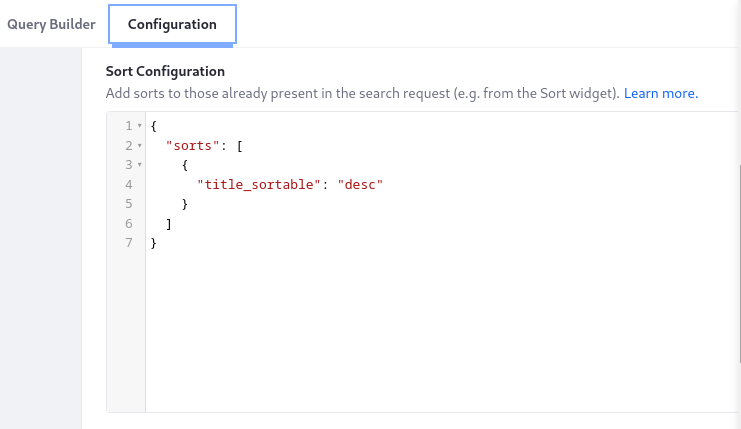

# Sorting Results in a Search Blueprint

Add a [sort configuration](./search-blueprints-configuration-reference.md#sort-configuration) to search blueprints to control the order of search results:

1. Open the *Global Menu* (), click the *Applications* tab, and select *Blueprints*.

1. [Create a blueprint](./creating-and-managing-search-blueprints.md) or open an existing one.

1. Click the *Configuration* tab and enter JSON into the Sort Configuration text area.



```{important}
* Avoid using both the [Sort widget](../../../search-pages-and-widgets/search-results/sorting-search-results.md) and a search blueprint to configure sorting on a search page. Liferay cannot guarantee consistent behavior.

* The examples below are simple. A robust sort configuration must consider all scenarios. For example, if a search result document does not contain the sort field, use the [`missing`](https://www.elastic.co/guide/en/elasticsearch/reference/7.x/sort-search-results.html#_missing_values) parameter to configure the sort behavior.

   See [Elasticsearch's sorting documentation](https://www.elastic.co/guide/en/elasticsearch/reference/7.x/sort-search-results.html) for more details.
```

## Example 1: Sorting by Title

A sort configuration is a JSON object with a `sorts` array defining the fields to sort by, either in ascending (`asc`) or descending (`desc`) order.

```json
{
   "sorts": [
      {
         "localized_title_${context.language_id}_sortable": "asc"
      }
   ]
}
```

```{tip}
* A search document can contain similarly named field variations, especially for localized text fields like `title`. Use a localized and sortable keyword variation of the field such as `localized_title_en_US_sortable`. Check each entity's document to find its available fields. For example, `title_sortable` is a common field, but the same entity may also contain `localized_title_en_US_sortable`.

* Instead of entering the language ID directly, use the `${context.language_id}` variable to auto-populate the four-letter language code (e.g., `en_US`) with the current language.

* To see a document's fields, click _Preview_ in the blueprint's toolbar, execute a search, and expand the fields for their results.
```

## Example 2: Sorting by a Structure Field

[Web Content Structure](../../../../content-authoring-and-management/web-content/web-content-structures.md) fields are indexed as nested fields in the search engine document.

When viewing the document, nested properties appear under `ddmFieldArray`:

```json
"ddmFieldArray" : [
          {
            "ddmFieldName" : "ddm__keyword__30805__department_en_US",
            "ddmValueFieldName" : "ddmFieldValueKeyword_en_US",
            "ddmFieldValueKeyword_en_US" : "true",
            "ddmFieldValueKeyword_en_US_String_sortable" : "true"
          }
]
```

To view the document with its nested fields,

1. Enable fetching the document `_source` by going to the blueprint's _Configuration_ tab and entering this JSON into the Advanced Configuration box:

    ```json
    {
       "source": {
          "fetchSource": true
       }
    }
    ```

1. Click _Preview_ in the toolbar, search for the result with the nested field, and expand its fields.

For a nested field, the sort configuration's field declaration is more complicated:

```json
{
   "sorts": [
      {
         "ddmFieldArray.ddmFieldValueKeyword_${context.language_id}_String_sortable": {
            "nested": {
               "nested_path": "ddmFieldArray",
               "nested_filter": {
                  "term": {
                     "ddmFieldArray.ddmFieldName": {
                        "value": "ddm__keyword__30805__department_${context.language_id}"
                     }
                  }
               }
            },
            "order": "asc"
         }
      }
   ]
}
```

## Example 3: Sorting by an Objects Field

[Object](../../../../building-applications/objects.md) entry fields are indexed as nested fields in the search engine document.

When viewing the document, an object's nested properties appear under `nestedFieldArray`:

```json
"nestedFieldArray" : [
            {
              "fieldName": "total",
              "valueFieldName": "value_integer",
              "value_integer": "8"
            }
]
```

To view the document with its nested fields,

1. Enable fetching the document `_source` by going to the blueprint's _Configuration_ tab and entering this JSON into the Advanced Configuration box:

    ```json
    {
       "source": {
          "fetchSource": true
       }
    }
    ```

1. Click _Preview_ in the toolbar, search for the result with the nested field, and expand its fields.

This example sorts by an object integer field:

```json
{
   "sorts": [
      {
         "nestedFieldArray.value_integer": {
            "nested": {
               "nested_path": "nestedFieldArray",
               "nested_filter": {
                  "term": {
                     "nestedFieldArray.fieldName": "total"
                  }
               }
            },
            "order": "desc"
         }
      }
   ]
}
```

## Related Topics

* [Search Blueprints Configuration Reference](search-blueprints-configuration-reference.md)
* [Sorting Search Results](../../../search-pages-and-widgets/search-results/sorting-search-results.md)
