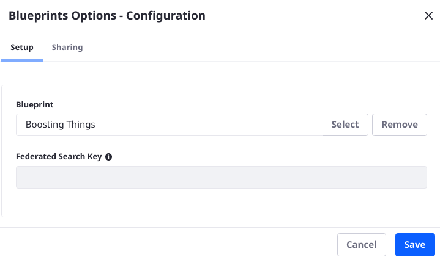

# Using a Search Blueprint on a Search Page

By default, a search page does not have a [search blueprint](./understanding-search-blueprints.md) associated with it. A blueprint must be applied to a [search page](../../../search-pages-and-widgets/working-with-search-pages.md) to affect the Liferay search experience. If a site has multiple search pages, follow the steps below on each page that should use a blueprint, as each must be configured separately. You can use different blueprints on each page, if desired.

To make the search page react to your search blueprint,

1. [Create a blueprint](./creating-and-managing-search-blueprints.md).
1. Create or navigate to the [search page](../../../search-pages-and-widgets/working-with-search-pages.md).
1. Add the Blueprint Options widget to the page. 
1. Click the widget's _Options_ icon () and click *Configuration*.
1. To choose a blueprint for the page, click _Select_.

   

1. Once the blueprint is selected, click _Save_ on the Configuration screen.

Now the blueprint's functionality is applied to the page.

Administrative users can instead use the [Low Level Search Options](../../../search-pages-and-widgets/search-results/understanding-low-level-search-options.md) widget to apply a blueprint to a search page. Open the widget's configuration. In the Attributes section, add

- Key: `search.experiences.blueprint.erc` \*
- Value: `[the blueprint's external reference code (ERC)]`

\* On versions before Liferay 2023.Q4/GA102, you must instead use the ID: `search.experiences.blueprint.id`. You can find the blueprint ID or ERC from the Blueprints application (Global Menu &rarr; Applications &rarr; Blueprints (Search Experiences). Click the blueprint to open its editor.

Unless you're already using the Low Level Search Options widget on your search page, the Blueprints Options widget is more convenient for setting a blueprint. If you must set other Search Context Attributes, perhaps for testing a blueprint, use the Low Level Search Options widget.

## Applying Additional Search Context Attributes

Blueprints are applied to the page using the Blueprints Options widget, or using a search context attribute in the Low Level Search Options widget, as described above. You can set additional search context attributes in the Low Level Search Options widget. There are two primary reasons you might need to set search context attributes into the search page:

1. A blueprint can define and respond to a custom parameter (one that isn't set by Liferay's search framework), and these can be set manually in the Low Level Search Options widget.
1. It can be useful to test the behavior of the blueprint on the search page by setting search context attributes and executing a search request.

   See [the Elements reference for more information](./search-blueprints-elements-reference.md) about the parameters used by the out of the box elements.

<!--
Follow this example to set search context attributes into a blueprint-driven search page:

1. Create two users: name them _Acme User_ and _Other User_.
   - Acme User
      - Screen Name: `acmeuser`
      - Email Address: `acme@liferay.com`
      - First Name: `Acme`
      - Last Name: `User`
   - Other User
      - Screen Name: `otheruser`
      - Email Address: `other@liferay.com`
      - First Name: `Other`
      - Last Name: `User`
1. Create a [User Segment](../../../../site-building/personalizing-site-experience/segmentation/creating-and-managing-user-segments.md) called _Acme Users_. Drag the User attribute and add Acme User to it. Record the segment's ID. It's in the URL as the parameter `segmentsEntryId`.
1. Create an [Asset Category](../../../../content-authoring-and-management/tags-and-categories.md). Name the Vocabulary and the Category _Business_. Record the Category's ID. It's in the URL as part of the path: `category/[ID]`.
1. Create two pieces of Basic Web Content:
   - Web Content 1
      - Title: Has Business Category
      - Content: Test
      - Category: Business
   - Web Content 2
      - Title: Without Business Category
      - Content: Test
1. [Create a blueprint](./creating-and-managing-search-blueprints.md) with the following Element:
   - Element Name: Boost Contents in a Category for a User Segment
      - Asset Category ID: The _Business_ Category's ID. 
      - User Segment IDs: The ID of the _Acme Users_ User Segment.
      - Boost: 100
1. Navigate to the site's search page.
1. Add the Low Level Search Options widget to the page, and open it's configuration screen.
1. In the Attributes section, add

   - Key: `search.experiences.scope.group.id`
   - Value: `[the site ID]`

You can find the blueprint ID from the Blueprints application (Global Menu &rarr; Applications &rarr; Blueprints (Search Experiences).
-->
<!-- Example is unfinished--uncomment when finalized. -->

