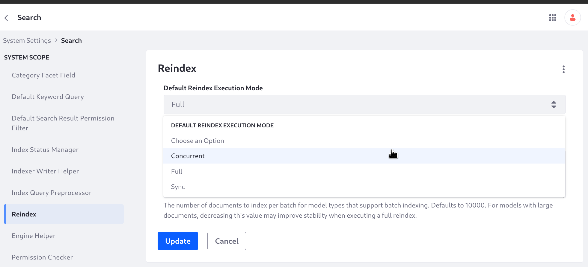

# Re-Indexing Modes

{bdg-secondary}`Liferay 7.4 2023.Q4+/GA98+`

*Re-indexing* is refreshing all or part of the search index that's used for searching, and in some cases displaying, Liferay's content. Execute a re-index from the [search administration panel](./search-administration.md) in Global Menu &rarr; Control Panel &rarr; Search &rarr; Index Actions. Choose from the 3 available re-indexing modes:

| Re-Index Mode     | Description                                                                                                     | Avoids Downtime | Supported Actions                                                                                              |
|:------------------|:----------------------------------------------------------------------------------------------------------------|:----------------|:---------------------------------------------------------------------------------------------------------------|
| Full              | Deletes the index first, then regenerates it.                                                                   | &#10008;        | &#10004; Global: all indexes<br>&#10004; Global: spell check dictionaries<br>&#10004; Single model re-indexing |
| Concurrent () | Creates a new index, leaving the old index in place (i.e., a blue/green re-index) until the new index is ready. | &#10004;        | &#10004; Global: all indexes<br>&#10008; Global: spell check dictionaries<br>&#10008; Single model re-indexing |
| Sync ()       | Updates existing search index documents, and deletes stale documents when finished.                             | &#10004;        | &#10004; Global: all indexes<br>&#10008; Global: spell check dictionaries<br>&#10004; Single model re-indexing |

```{note}
Concurrent and Sync mode are only available [with Elasticsearch](../installing-and-upgrading-a-search-engine/solr/solr-limitations.md).
```

## Choosing the Re-Index Mode

A full re-index works in any scenario, whether for all content and indexes or a single model. However, it's not always the best choice. To avoid downtime due to a long running full re-index process, use concurrent or sync mode whenever possible.

| Re-Index when:                        | Full     | Concurrent () | Sync () |
|:--------------------------------------|:---------|:---------|:---------|
| [Installing a new Elasticsearch cluster](../installing-and-upgrading-a-search-engine/elasticsearch/installing-elasticsearch.md) | &#10004; | -        | -        |
| [Updating field mappings](../installing-and-upgrading-a-search-engine/elasticsearch/advanced-configuration-of-the-liferay-elasticsearch-connector.md) | &#10003; | &#10004; | -        |
| [Updating index settings](../installing-and-upgrading-a-search-engine/elasticsearch/advanced-configuration-of-the-liferay-elasticsearch-connector.md) | &#10003; | &#10004; | -        |
| [Upgrading Liferay](../../installation-and-upgrades/upgrading-liferay.md) | &#10003; | &#10004; | &#10003; |
| [Upgrading Elasticsearch](../installing-and-upgrading-a-search-engine/elasticsearch/upgrading-elasticsearch.md) | &#10003; | &#10004; | &#10003; |
| Re-indexing after a connection outage | &#10003; | &#10004; | &#10003; |
| Re-indexing a single model[^1]        | &#10003; | -        | &#10004; |

&#10004; The mode is recommended for the scenario

&#10003; The mode is available for the scenario

\- The mode is not available for the scenario

[^1]: Re-indexing a single model is occasionally required, and sync mode is recommended in these cases. For example, using certain elements while [creating a search blueprint](../liferay-enterprise-search/search-experiences/search-blueprints/creating-and-managing-search-blueprints.md#adding-elements-to-the-blueprint) and [enabling semantic search](../liferay-enterprise-search/search-experiences/semantic-search.md) require re-indexing individual model types.

## Understanding Re-Index Modes

In earlier Liferay versions, re-indexing always deleted content from the live production index before regenerating it. This could result in significant search index downtime. With concurrent and sync re-index modes, re-indexing is accomplished without deleting the index first. Sync mode updates the index in place, while with concurrent mode the old version of the index is preserved while a new index is built in the background. High availability of the search index means minimal downtime, which means your site's users can browse and search your site while you re-index the site's content.


Whenever possible, choose concurrent or sync mode to avoid downtime during a re-index. However, there are considerations to account for when deciding which mode is right in your situation.

###  Full Re-Index Mode

You must use _full_ mode to index all content when connecting to a new, empty Elasticsearch cluster. In this scenario, high availability is not a consideration. You can also use full mode for single model re-indexing when sync mode will not suffice, but sync mode is recommended.

###  Concurrent Re-Index Mode

Use _concurrent_ mode for high availability re-indexing of all content using a blue/green re-indexing strategy, as long as primary disk space for Elasticsearch is not an issue. Concurrent mode cannot be used for single model re-indexing.

Because concurrent re-indexing creates a new index alongside the old one, it requires more disk space in the Elasticsearch system's infrastructure than the other modes. To avoid errors due to insufficient disk space, Liferay estimates whether the available space is sufficient and warns you if it isn't:


###  Sync Re-Index Mode

Use _sync_ mode for high availability re-indexing when primary disk space for Elasticsearch is a concern, or for all high availability single model re-indexing needs. There are scenarios when sync mode can't properly account for system changes, and one of the other modes must be used.

<!-- Verify, then document that sync mode cannot account for mappings and index settings changes -->

## Setting the Default Re-Indexing Mode

Full re-index mode is the default. To change it,

1. Go to _Global Menu_ &rarr; _Control Panel_ &rarr; _System Settings_.

1. Open the _Reindex_ entry under Platform &rarr; Search.

1. Set the _Default Reindex Execution Mode_ and click _Update_.


