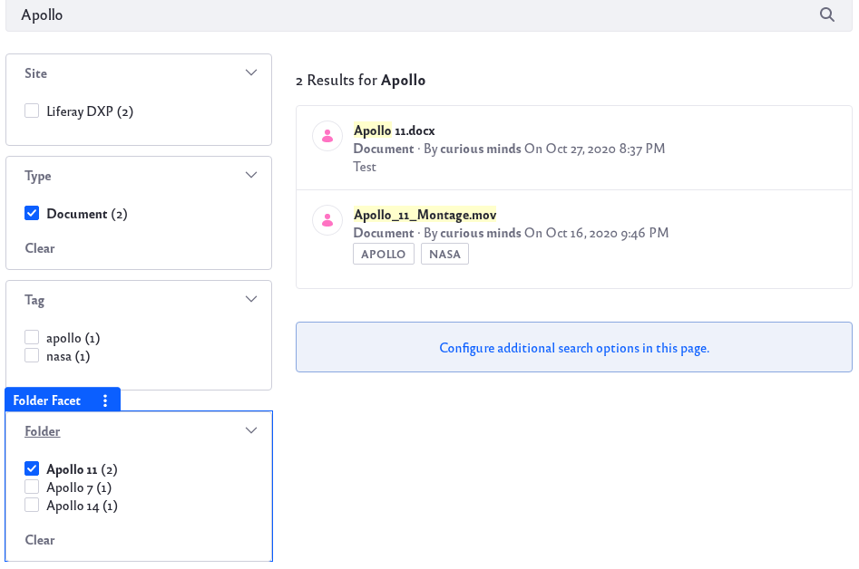
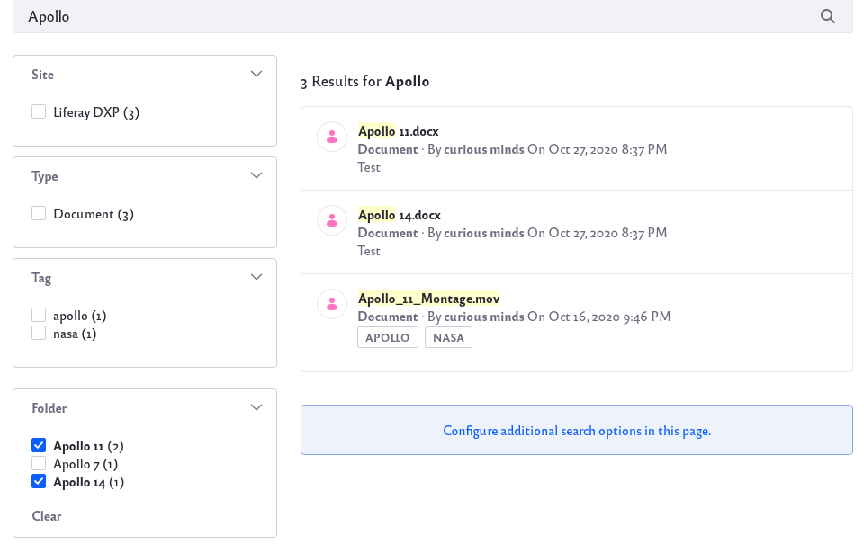

---
toc:
- ./search-facets/site-facet.md
- ./search-facets/type-facet.md
- ./search-facets/category-facet.md
- ./search-facets/tag-facet.md
- ./search-facets/folder-facet.md
- ./search-facets/user-facet.md
- ./search-facets/modified-facet.md
- ./search-facets/custom-facet.md
---
# Search Facets

```{toctree}
:maxdepth: 2

search-facets/site-facet.md
search-facets/type-facet.md
search-facets/category-facet.md
search-facets/tag-facet.md
search-facets/folder-facet.md
search-facets/user-facet.md
search-facets/modified-facet.md
search-facets/custom-facet.md
```

# Facets

Enter a keyword in the Search Bar and click the Search button. The default search experience redirects to a page with results on the right and a collection of *facets* on the left.

- [Site Facet](search-facets/site-facet.md)
- [Type Facet](search-facets/type-facet.md)
- [Category Facet](search-facets/category-facet.md)
- [Tag Facet](search-facets/tag-facet.md)
- [Folder Facet](search-facets/folder-facet.md)
- [User Facet](search-facets/user-facet.md)
- [Modified Facet](search-facets/modified-facet.md)
- [Custom Facet](search-facets/custom-facet.md)


A facet aggregates search results by a common characteristic, or facet term. 

## Using Facets

Click one or more facet terms to filter through the search results efficiently. For example, if you search for documents related to Apollo, you can check a term in the Type facet.


To look specifically for documents related to Apollo 11, you might also check the term in the folder facet.



In this way, you can pare down your search results.

## Multiple Facet Selection

As seen in the example above, selecting terms in different facets is subtractive (i.e., it uses the AND operator). That is, only results that match all of the filter criteria are returned.

However, selecting terms within an individual facet is additive (i.e., it uses the OR operator). That is, the combined results for each term are returned. For example, if you wanted to filter the search results for both the Apollo 11 folder and Apollo 14 folder, you could check both terms.



## Facets and Friendly URLs

The Search functionality uses friendly search URLs for facet filtering. With default settings, here's the default main search URL when searching for keyword *test*:

    http://localhost:8080/web/guest/search?q=test

Selecting a facet term adds a new parameter to the above URL. For example, selecting Blogs Entry from the Type facet results in this URL:

    http://localhost:8080/web/guest/search?q=test&type=com.liferay.blogs.model.BlogsEntry

Selecting another facet term from the same facet category appends the same parameter again, but with the newly selected value:

    http://localhost:8080/web/guest/search?q=test&type=com.liferay.blogs.model.BlogsEntry&type=com.liferay.portal.kernel.model.User

The rest of the facets work the same way. Filtering by the last hour option in the Last Modified facet produces this URL: 

    http://localhost:8080/web/guest/search?q=test&modified=past-hour

The parameter names are configurable for each facet.

To learn more details of each facet type, refer to their individual articles.

