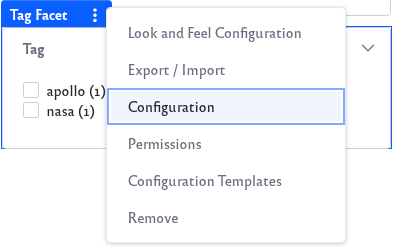
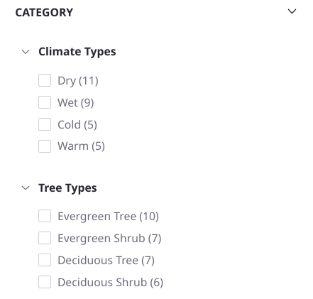
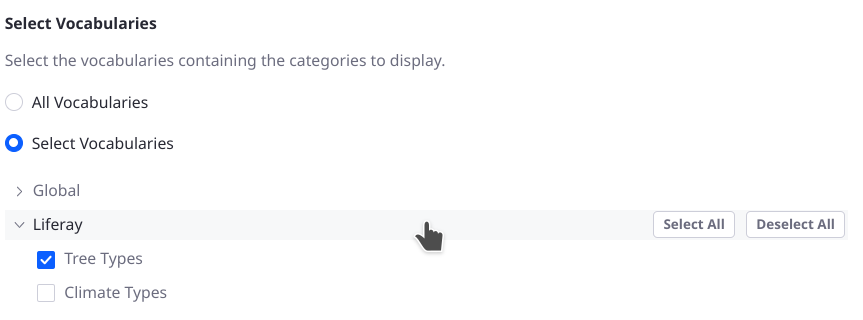
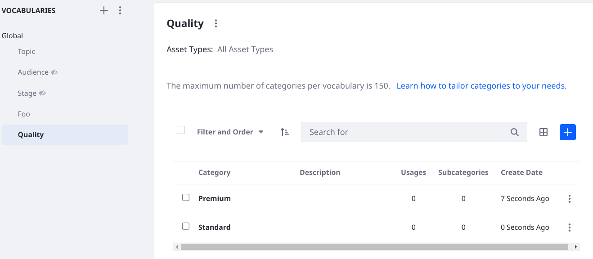
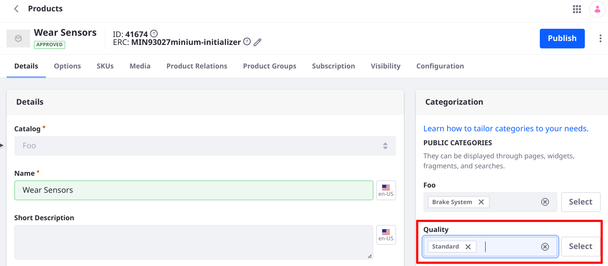
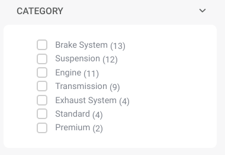
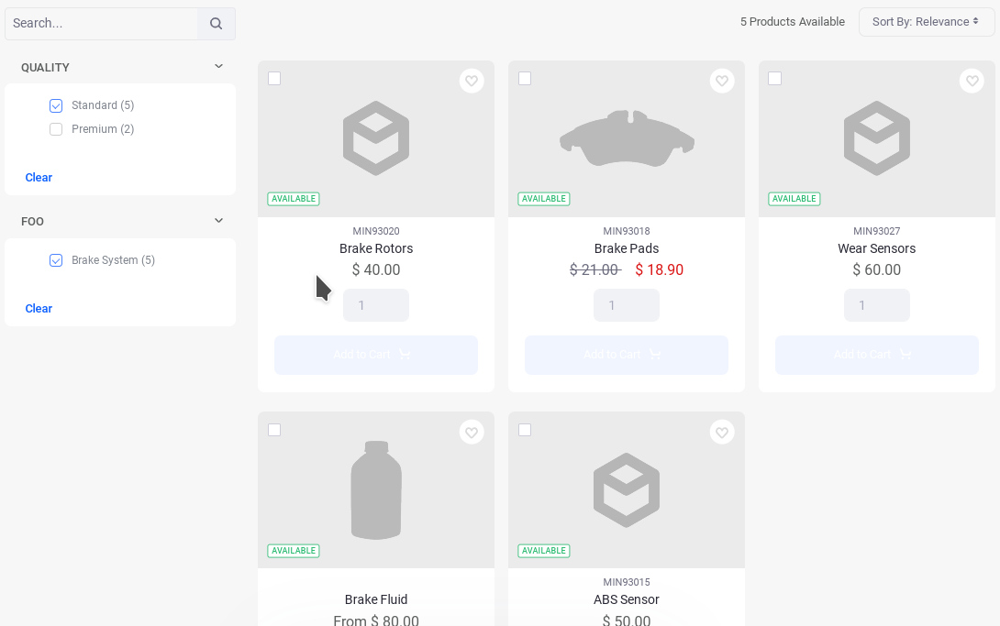

---
taxonomy-category-names:
- Search
- Search Pages and Widgets
- Categories and Tags
- Liferay Self-Hosted
- Liferay PaaS
- Liferay SaaS
uuid: f25e9daa-89c4-4444-a177-8686c5fbbede
---
# Category Facet

The Category Facet narrows search results for categorized assets that match the search query keywords. Each matching result's categories are aggregated as facet terms.

## Configuring the Category Facet

To configure the Category Facet, open the facet's _Options_ menu () and click *Configuration*.

The Display Settings appear first:

**Display Template:** Choose between *Default*, *Cloud Layout*, *Compact Layout*, *Label Layout*, and *Vocabulary Layout* (available in 7.4 Update/GA 48+). The Default Layout shows checkboxes next to each term, but the Compact layout does not. The Label layout shows small clickable labels for each term. The [Vocabulary Layout](#display-facet-terms-categories-by-vocabulary) shows the facet terms (categories) organized by vocabulary.

The Advanced Configuration section contains additional options: 

**Category Parameter Name:** Change the parameter name in the URL for the Facet. The default is *category*. 

!!! important
    To achieve AND style selection between facet widgets, you must configure a different Category Parameter Name for each widget. By default all Category Facet widgets have this field set to _category_. The [example below](#example-creating-a-hierarchic-filtering-experience-in-the-category-facet-using-vocabularies) demonstrates a use case. 

**Max Terms:** Set the maximum number of facet terms to display, regardless of how many matching terms are found for the facet.

**Frequency Threshold:** Set the minimum frequency required for terms to appear in the facet term list. For example, if the facet's frequency threshold is set to 3, a term with two matching results doesn't appear in the term result list.

**Display Frequencies:** Choose whether to display the term frequencies.

**Order Terms By:** For Liferay 7.4 U56+/GA56+, you can choose the facet term sorting strategy: Term Frequency Descending (default), Term Frequency Ascending, Term Value Ascending, or Term Value Descending. The default sorting orders facet terms from most matches to least. Term value options order facet terms alphabetically.

### Displaying and Filtering Facet Terms by Vocabulary

{bdg-secondary}`7.4 U48+ and GA48+`

By default the Category Facet widget collects the categories of the matching results from every vocabulary in the site and displays them in a flat list. With the enhancements made in Update 48, you gain new display and filtering behaviors.

#### Display Facet Terms (Categories) by Vocabulary

Display categories under their vocabulary by selecting the Vocabulary Layout in the Category Facet's configuration screen. 

#### Filter Facet Terms (Categories) by Vocabulary

Select the vocabularies and categories to display in the facet.

!!! important
    If you're upgrading from a Liferay version or update prior to 7.4 Update/GA 48 and there are already categorized assets in the system, re-index all search indexes to include the necessary `assetVocabularyCategoryIds` field in the search documents.

With this behavior you can provide a powerful search facet experience: see the [example below](#example-creating-a-hierarchic-filtering-experience-in-the-category-facet-using-vocabularies) for one use case.

## Example: Creating a Hierarchic Filtering Experience in the Category Facet Using Vocabularies

Consider a commerce portal for buying auto parts. Each part is a commerce product categorized in distinct vocabularies:

- Vocabulary: Vehicle System

   Categories: 
   - Brake System
	- Engine
	- Exhaust System
	- Suspension
	- Transmission
	- Turbocharger

- Vocabulary: Quality 

   Categories:
   - Premium
   - Standard

When users select Engine and Exhaust System, they expect to see products matching either category. If they then select the Premium category from the Quality vocabulary, they expect the results to be narrowed to just premium auto parts for the engine and exhaust systems. This can be accomplished out-of-the-box as of 7.4 Update/GA 48.

To configure the use case above,

1. Create a new site from Global Menu &rarr; Control Panel &rarr; Sites. When prompted select the Minium site template.
1. Name the site Foo and click _Add_.
1. Go to the Global site's menu &rarr; Categorization &rarr; Categories. Add a vocabulary named Quality and create two categories: Premium and Standard.

   !!! important
       You must create a global category in the Global site, rather than a site category in the Foo site.

   !!! note
       There's an existing vocabulary created by the site template during site initialization (named Foo after the site): it's better named _Vehicle Systems_ to match the example you're building and characterize the categories better (e.g., Brake System). However, the Foo vocabulary's categories are referenced by existing Commerce products, so it cannot be edited. 

   

1. Categorize some of the existing Commerce Products in Global Menu &rarr; Commerce &rarr; Products (under the Product Management section).

   Add the Premium category to

   - Premium Brake Fluid
   - Premium Brake Pad

   Add the Standard category to several additional products, such as

   - ABS Sensor
   - Brake Fluid
   - Wear Sensors
   - Brake Pads
   - Brake Rotors

   

1. Go to the Foo site's home page. By default a Minium site's home page is the product catalog, which is essentially a search page with Allow Empty Searches enabled.

   Look at the Category Facet widget: the categories of both vocabularies are shown in one flat list. Selecting multiple facet terms (e.g., Suspension and Standard) expands the results on the page: this demonstrates OR operator behavior among facet terms.

   

   Some of the widgets on the page are Commerce-specific widgets (e.g. the Specification Facet) but the Category Facet is the standard search widget.

1. On the Foo site's home page add a Category Facet widget configured to show only the Foo vocabulary's categories. 

   - Click the *plus icon* at the top of the page ().
   - Drag a *Category Facet* widget directly above or below the existing one.
   - Open the *Widget Configuration* screen ().
   - Open the Display Template selector and choose _Vocabulary Layout_.
   - Change the Category Parameter Name to _foocategories_.
   - Click the _Select Vocabularies_ radio button. Expand _Global_ and select _Foo_.
   - Click _Save_.

1. Using a similar procedure, configure the original Category Facet widget to display only the Quality vocabulary's categories and use the Vocabulary Layout template. Since you already changed the new Category Facet widget's Category Parameter Name, you can leave the default value in the existing widget.

1. Refresh the page. Selecting the Brake System and Suspension categories in the Category Facet widget showing the Foo vocabulary ensures that the displayed products match the category of Brake System OR Suspension.

   Selecting Standard from the Category Facet showing the Quality categories narrows the results to only those products categorized as Brake System OR Suspension AND Standard.

