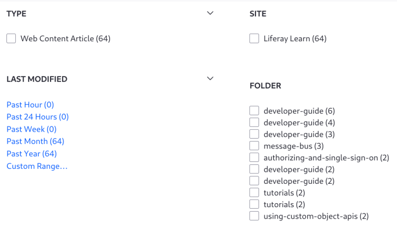
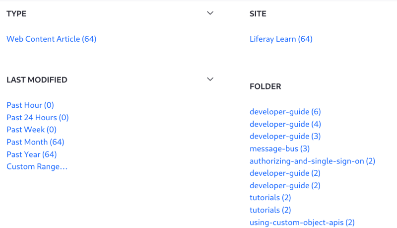
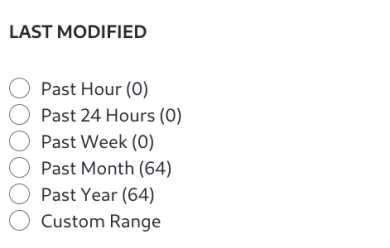
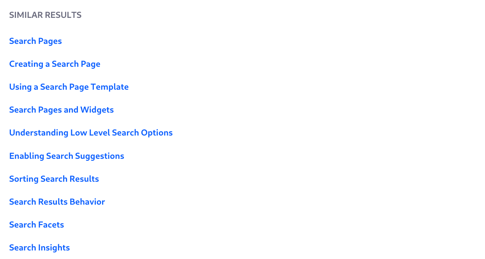
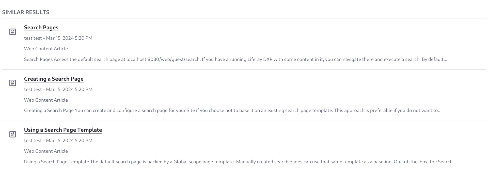
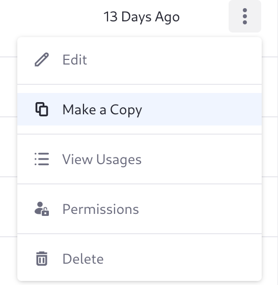
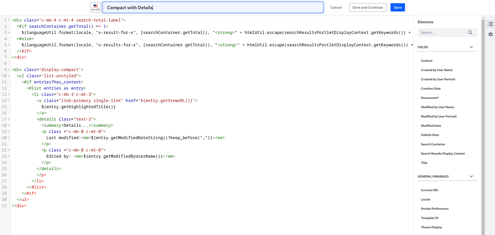
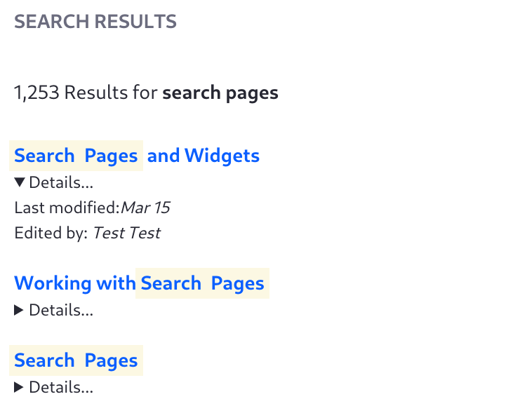

---
taxonomy-category-names:
- Search
- Search Pages and Widgets
- Widgets
- Liferay Self-Hosted
- Liferay PaaS
- Liferay SaaS
uuid: 6accf706-b809-4189-b014-2a90d4362f04
---
# Using Search Widget Templates

The search widgets' default views are useful, but often you need a different design. You can choose from one of the available widget templates, or create a new one. See [Styling Widgets with Widget Templates](../../site-building/displaying-content/additional-content-display-options/styling-widgets-with-widget-templates.md) to learn about creating templates for a widget's display.

From [each widget's](../search-configuration-reference.md#search-widgets) configuration, use the Display Template field to choose from available configurations. Available templates include those created specifically for the widget you're configuring, in the Global site or the current site.

From Instance Settings you can change the default template for a widget, so that when you add the widget to a page it defaults to the configured template. Doing this requires getting the widget template's key from the template editor.


There are several out-of-the-box templates you can choose from.

## Using the Out-of-the-Box Templates

You can use the out-of-the-box widget templates as-is or use them as the base for [creating your own widget template](#creating-a-search-widget-template).  Here you can see what they look like to decide if they're right for your use case.

### Custom Filter

The Default template:


The Compact Layout template:


### Search Bar

The Default template:


The Left Aligned Icon Layout template:


!!! Note
    The Left Aligned Icon Layout template does not support [search bar suggestions](./search-bar-suggestions.md).

### Search Facets

A Default template is available for all search facet widgets:



The Compact Layout template is available for all but the Modified facet widget:



The Label Layout template is available for all but the Modified facet widget:


The Cloud Layout template is available for the Tag Facet and Category Facet widgets:


The Vocabulary Layout template is available for the [Category Facet widget](./search-facets/category-facet.md):


The Radio Layout template is available for the Modified Facet:



### Search Results

The default template is the _List Layout_, displays results in a paginated list.


Use the _Card Layout_ to display results in rows of cards.


Use the _Compact Layout_ to display just a list of titles.


### Similar Results

The Compact Layout template is the default:



The List Layout template:


The Card Layout template:



## Creating a Search Widget Template

To create a widget template,

1. Go to the site where you want to use the template.

   !!! note
       The out-of-the-box widget templates are all added to the Global site. You can do the same or add yours to a specific site.

1. Open _Site_ &rarr; _Design_ &rarr; _Templates_.

1. Click the _Widget Templates_ tab.

1. Click _New_ &rarr; _More_.

1. From the list of widgets, choose the widget your template should target. 

   !!! Note
       The first listing for _Search Results Template_ targets the Search Results widget, while the second listing with the same name targets the Commerce Search Results widget.

1. Using the editors predefined variables, create your template using FreeMarker.

1. _Save_ the template when finished.

Once you save the template, you can select it from the Search Results widget.

Rather than writing a widget template from scratch, you can accelerate the template development process by copying an existing template and modify it.

To copy an existing template,

1. Go to the Global site. Click _Select Site_ () &rarr; _My Sites_ &rarr; _Global_.

1. Open _Site_ &rarr; _Design_ &rarr; _Templates_.

1. Click the _Widget Templates_ tab.

1. Search for the title of the template you want to copy. For example, search for _compact_ if you're hoping to start with the FreeMarker for the Compact Layout template. 

1. When you find the entry for the widget you're interested in, click _Actions_ () &rarr; _Make a Copy_.

   

1. Using the editor's predefined variables and your own FreeMarker, create the template.

   

1. Click _Save_.

## Example: Extending the Search Results Widget's Compact Layout Template

In this example, extend the Compact Layout template to include the last modified date of the result:

1. In the Global site's menu, open _Site_ &rarr; _Design_ &rarr; _Templates_ and click the _Widget Templates_ tab.

1. Search for _compact_, then click _Actions_ () &rarr; _Make a Copy_ for the Search Results Template.

1. Name it _Compact with Details_.

1. Your copy appears in the list with the others, so click _Compact with Details_ to begin editing.

1. Replace the list item with this code:

   ```html
   <li class="c-mb-3 c-mt-3">
      <a class="link-primary single-link" href="${entry.getViewURL()}">
         ${entry.getHighlightedTitle()}
      </a>
      <details class="text-2">
         <summary>Details...</summary>
         <p class ="c-mb-0 c-mt-0">
            Last modified:<em>${entry.getModifiedDateString()?keep_before(",")}</em>
         </p>
         <p class ="c-mb-0 c-mt-0">
            Edited by: <em>${entry.getModifiedByUserName()}</em>
         </p>
      </details>
   </li>
   ```
1. Click _Save_.



## Related Topics

* [Search Configuration Reference](../search-configuration-reference.md)
* [Styling Widgets with Widget Templates](../../site-building/displaying-content/additional-content-display-options/styling-widgets-with-widget-templates.md)
