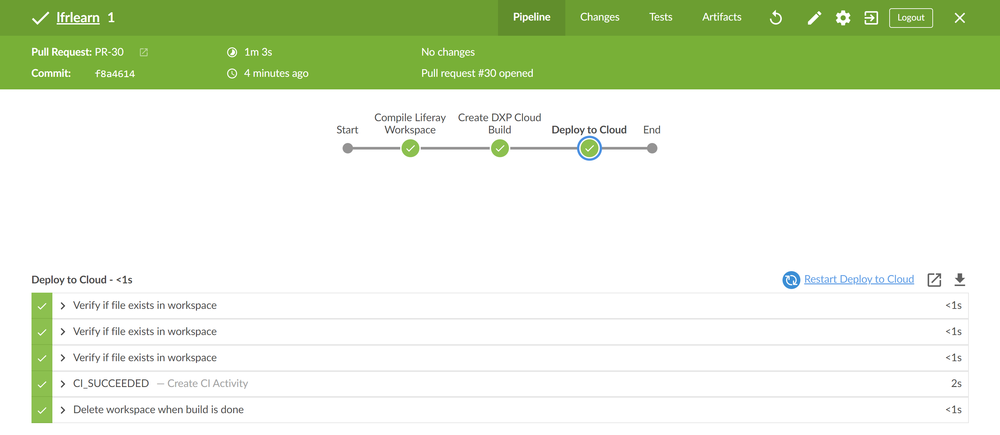
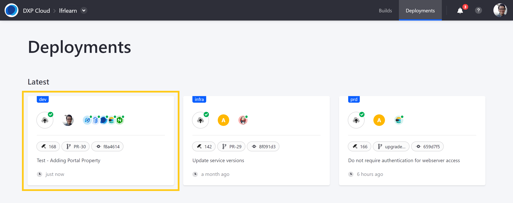
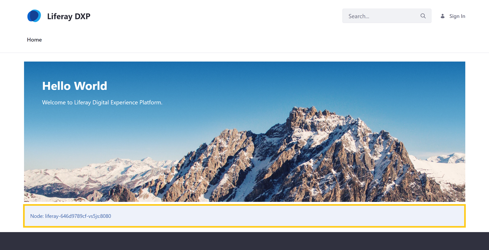

# Deploying Changes via the Liferay Cloud Console

This tutorial walks through the process of adding a portal property to the Liferay service, triggering a CI build with a pull request, and deploying the new build to the `dev` environment via the Liferay Cloud console.

To get started, you need a code hosting service integrated with your project's CI service and a local, working copy of your project's repository.

```{note}
For an alternative deployment workflow, see [Deploying Changes via the CLI Tool](./deploying-changes-via-the-cli-tool.md)_ to learn how to deploy local changes to your project environments using the Liferay Cloud Platform CLI tool.
```

* [Adding a Portal Property to the Liferay Service](#adding-a-portal-property-to-the-liferay-service)
* [Triggering a Jenkins Build with a Pull Request](#triggering-a-jenkins-build-with-a-pull-request)
* [Deploying Your New Build via the Liferay Cloud Console](#deploying-your-new-build-via-the-liferay-cloud-console)
* [Verifying Your Sample Deployment](#verifying-your-sample-deployment)

## Adding a Portal Property to the Liferay Service

Begin the deployment life cycle by adding a portal property to the `dev` environment's Liferay service and committing your changes:

1. Ensure your local master branch is up-to-date with the latest version of your project's repository.

1. Create a new working branch based on your up-to-date master branch.

   ```bash
   git checkout -b example-console-deployment-branch
   ```

1. Go to `<project>\liferay\configs\dev\portal-env.properties`, and add the following property:

   ```properties
   web.server.display.node=true
   ```

1. Add and commit your changes to the `portal-env.properties` file with the following commands:

   ```bash
   git add .
   ```

   ```bash
   git commit -m "Test - Adding Portal Property"
   ```

## Triggering a Jenkins Build with a Pull Request

Next, trigger a Jenkins build with a pull request to your project's central Git repository:

1. Push your new branch to the origin of your local repository.

   ```bash
   git push -u origin example-console-deployment-branch
   ```

1. Navigate to your Git repository, and trigger a Jenkins build with a new pull request to your project's central repository.

   

   You can track the status of your build and view detailed logs via your project's Jenkins page: `https://ci-<project-name>-infra.lfr.cloud`

   

   

## Deploying Your New Build via the Liferay Cloud Console

Once your new build is ready, deploy it to your project's `dev` environment via the Liferay Cloud console:

1. Navigate to the *Builds* page for your project in the Liferay Cloud console. You can access this page from any project environment.

1. Click on the *Actions* button ( ⋮ ) for the build you want to deploy, and select *Deploy Build To...*

   

1. Use the drop-down menu to select the `dev` environment.

   

1. Use the checkboxes to confirm your deployment, and click on *Deploy Build*.

   

   ```{tip}
   You can also access the *Deploy Build to...* page by clicking on the *Build ID* for the build you want to deploy.
   ```

   You can view the status of your deployment from the *Deployments* page, as well as the *Logs* and *Activities* pages of the `dev` environment.

   

## Verifying Your Sample Deployment

Once your build has successfully deployed and your `dev` environment's Liferay service is *Ready*, follow these steps to verify your changes:

1. Navigate to your project's `dev` environment.

1. Go to the *Web Server* service's page, and click on its URL to access the `dev` environment's Liferay instance: `https://webserver-<project-name>-dev.lfr.cloud/`.

   

1. Verify the web server node is displayed at the bottom of the Home Page.

   

## Related Topics

* [Overview of the Liferay Cloud Development Workflow](./overview-of-the-liferay-cloud-deployment-workflow.md)
* [Deploying Changes via the CLI Tool](./deploying-changes-via-the-cli-tool.md)
* [Setting Up Automatic Deployment](./automatically-deploying-ci-service-builds.md)
* [Configuring the Liferay Service](../using-the-liferay-dxp-service/configuring-the-liferay-dxp-service.md)
