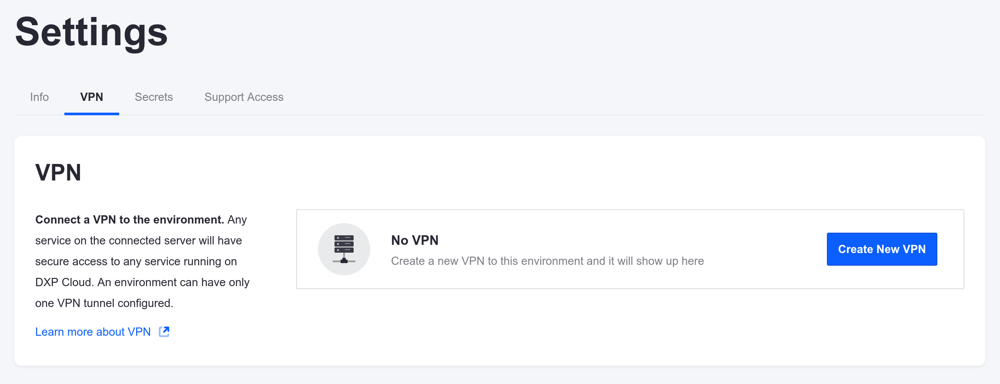
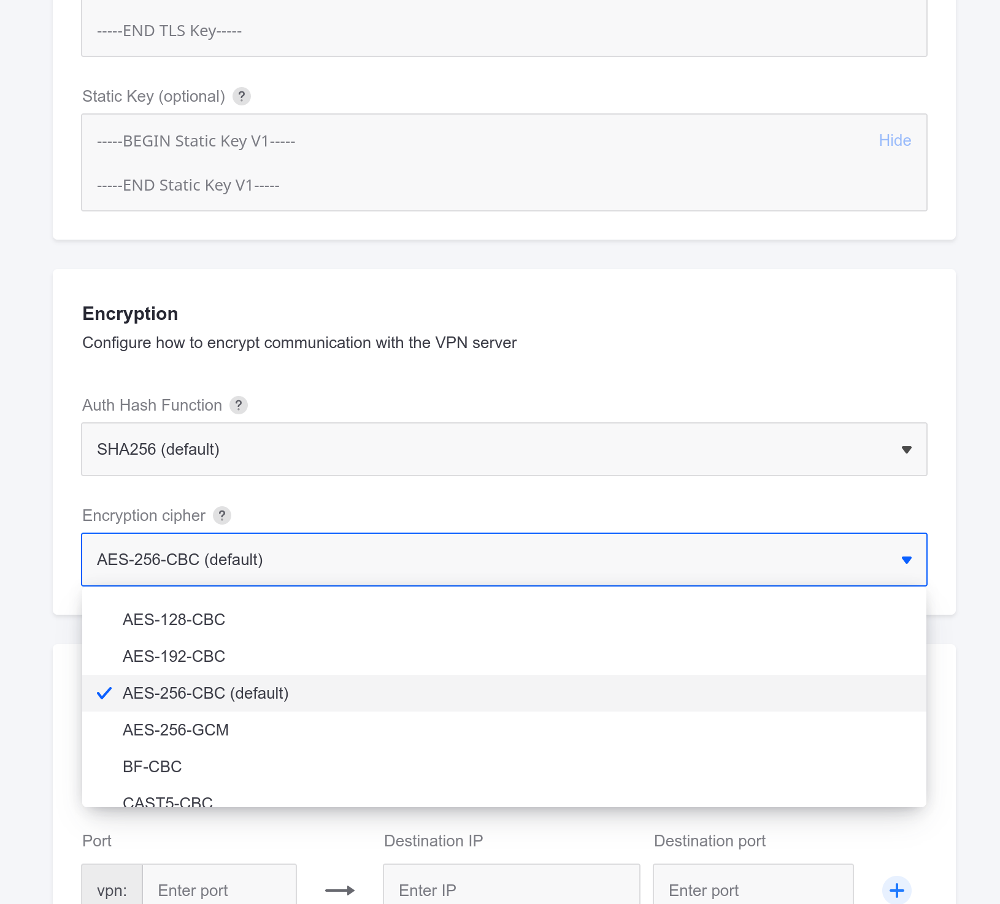
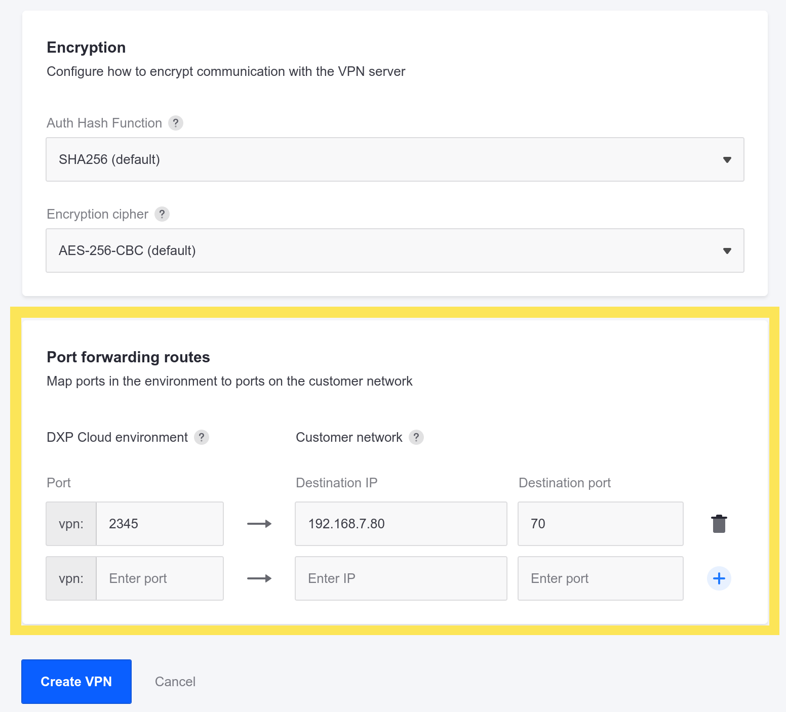
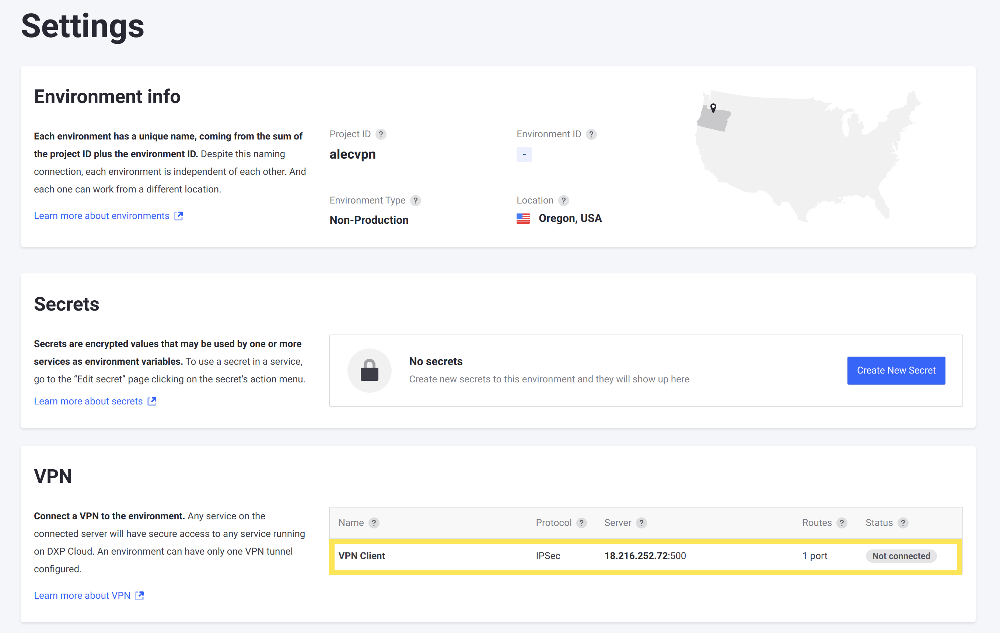
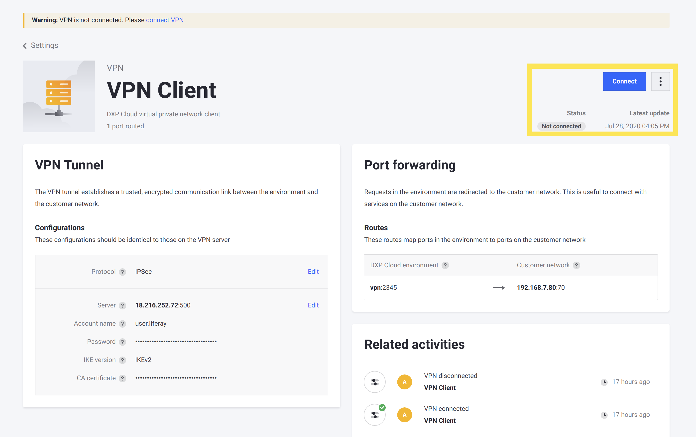
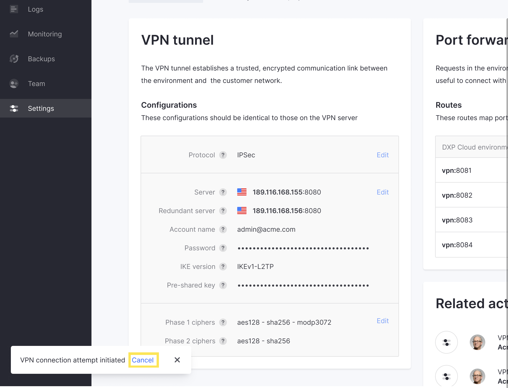
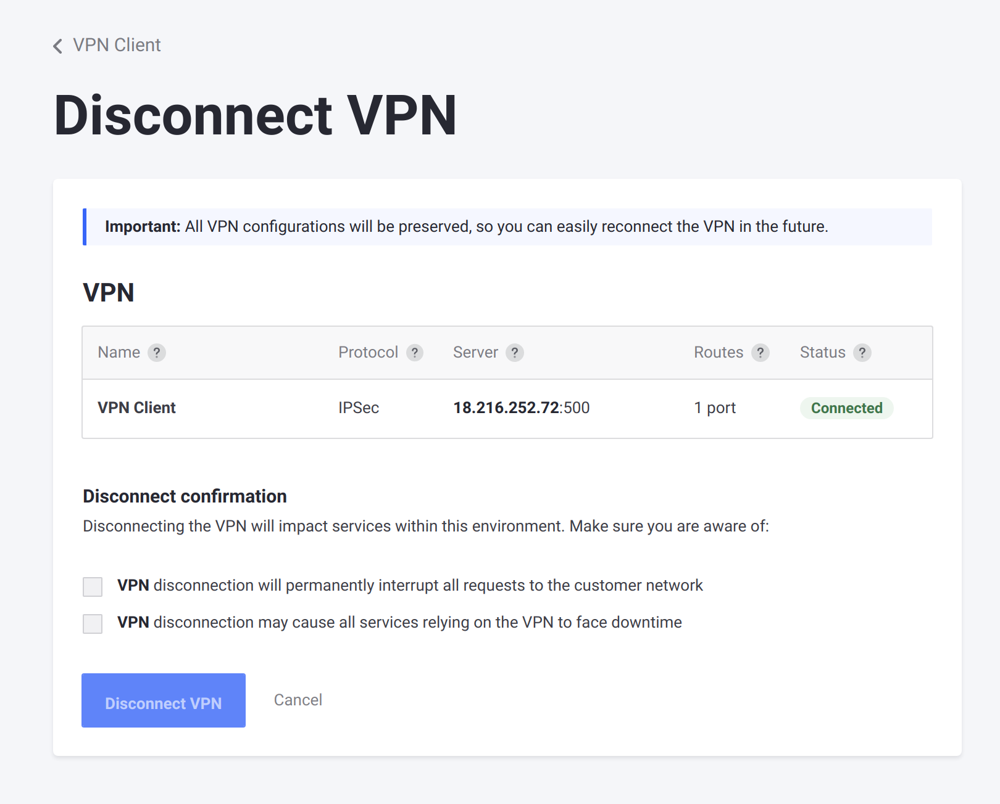
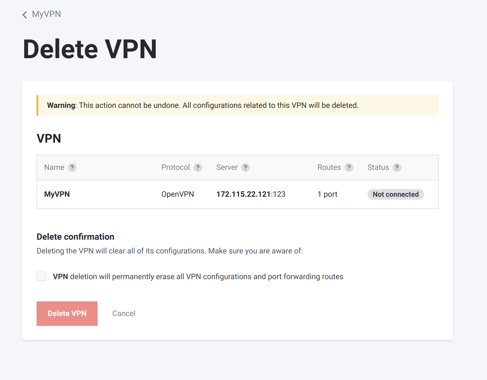

---
taxonomy-category-names:
- Cloud
- Cloud Platform Administration
- Cloud Platform Networking
- Liferay PaaS
uuid: 820c2c07-28b8-4a9c-9d09-a4225f8eda65
---
# Connecting a VPN Server to Liferay Cloud

You can use Liferay Cloud's VPN feature to connect your Liferay Cloud services to external services on private networks. This allows you to operate an external system with the Cloud environment as though they exist within the same network.

For example, you may need to connect your Liferay Cloud services to directories or applications that are only accessible on a company VPN. You'll learn how to do this here.

## Creating a VPN Configuration

1. Navigate to your environment in the console and click *Settings*.

1. Click the *VPN* tab.

1. Click *Create New VPN*.

   

1. Enter a name for the VPN connection and (optionally) a description.

1. Select the connection protocol to use. Here are the supported protocols:

   - [OpenVPN](https://openvpn.net)

   - [IPSec](https://www.cloudflare.com/learning/network-layer/what-is-ipsec/)

   

   Selecting a protocol reveals the required fields to connect with it below.

1. Fill in the VPN's required fields:

   - **Server**: The server's IP address.

   - **Port**: The VPN's local port number.

   - **Communication Protocol**: (OpenVPN only) UDP or TCP protocol for the connection.

   - **Compression Mode** (OpenVPN only): The compression algorithm to use for transmitted data (if any).

   - **IKE Version**: (IPSec only) The VPN's Internet Key Exchange version. This field only appears when *IPSec* is selected as the protocol. Only *IKEv2* is supported.

   - **Authentication Method** (IPSec only): Choose EAP-MSCHAPv2, EAP-TLS, or a pre-shared key for authentication.

   - **Account Name**: The administrator's email address.

   - **Password**: The administrator's password.

   - **CA Certificate**, **Server Certificate** and **Client Certificate**: The certificate code.

   - **Pre-shared Key**: (IPSec + Preshared-Key only) The pre-shared key created by your VPN server. 

   !!! tip
       It's good practice to periodically update your PSK (pre-shared key). You can generate new PSKs or revoke existing ones in the VPN details page.

1. If you're using OpenVPN and your VPN requires a valid client certificate, add a TLS certificate and key.

1. If you're using OpenVPN and your VPN has static key enabled, add the static key.

1. (Optional) Select an auto hash function used to generate an HMAC signature for data authenticity and the encryption algorithm used. The default values are `SHA256` and `AES-256-CBC`, respectively.

   

1. Enter one or more port forwarding routes for your VPN connection. Fill in the required fields for each route:

   - **Forwarded Port**: The port number within the Liferay Cloud environment to forward.

   - **Destination IP**: The IP address of the customer network interfacing with the VPN.

   - **Destination Port**: The port of the customer network interfacing with the VPN.

   

   !!! tip
       Add more port forwarding routes by clicking the + icon on the right side. Remove added routes by clicking the Trash icon beside the existing route.

1. Click *Create VPN*.

The VPN configuration has been created. However, the VPN is not connected until you connect it manually from the VPN details page.

## Managing Your VPN Configuration

Once you have created your VPN configuration, you can view the status of the connection and configuration details, edit the configuration, and connect or disconnect from the details page.

Navigate to your environment's *Settings* page and then click on the configured VPN connection to get to the details page.

!!! note
    The status of the VPN (connected or not connected) is visible both from the VPN details page, as well as the VPN section of the `Settings` page of your environment.

### Connecting and Disconnecting the VPN

The VPN details page indicates if the VPN is already connected in the top-right corner. If the VPN is not connected, then click the *Connect* button to establish the connection.

The VPN attempts to connect after clicking the button. If the connection fails, then the failed attempt displays in the *Related Activities* section of the details page.

!!! tip
    You can test the connectivity of your services to an IP address manually through your VPN by using the service's [shell](../support-and-troubleshooting/troubleshooting/shell-access.md) to run a command like the following: `curl -v [address]`.

While the connection is being established, the message "VPN connection attempt initiated" appears, and you cannot perform other management operations for your VPN until it completes. If you must cancel the connection (for example, because an error is causing the connection to hang), then click "Cancel" on the pop-up.

To disconnect the VPN any time after the connection is established, click *Disconnect* from the top-right Actions menu. This takes you to the *Disconnect VPN* page.

!!! warning
    Disconnecting the VPN interrupts communications with any external services with Liferay Cloud.

Check the boxes confirming the impact of disconnecting the VPN, and then click *Disconnect VPN* to immediately disconnect it. Once the VPN is disconnected, the configuration can be changed again.

### Editing the Configuration

You can change any details of the VPN configuration (including forwarding ports) after it has been created **as long as the VPN is not currently connected**. If the VPN is connected, then [disconnect it](#connecting-and-disconnecting-the-vpn) before editing the configuration.

To edit the configuration, go to the environment's details page, and then *Edit...* from the top-right Actions menu. This displays the same screen as creating the VPN configuration for the first time.

### Deleting the Configuration

You can completely remove a VPN configuration by using the *Delete VPN* option.

1. From your environment's Settings page, click the Actions menu for the VPN and click Delete VPN.

1. On the Delete VPN page, check the checkbox to confirm the deletion. More checkboxes appear to confirm the effects if the VPN is connected at the time.

   

1. Click Delete VPN at the bottom of the page.

The VPN is deleted and can no longer be used for your environment. Add a new VPN configuration to connect to your environment instead.

## Related Topics

- [VPN Integration Overview](./vpn-integration-overview.md)
- [Configuring a VPN Server](./configuring-a-vpn-server.md)
- [Shell Access](../support-and-troubleshooting/troubleshooting/shell-access.md)
