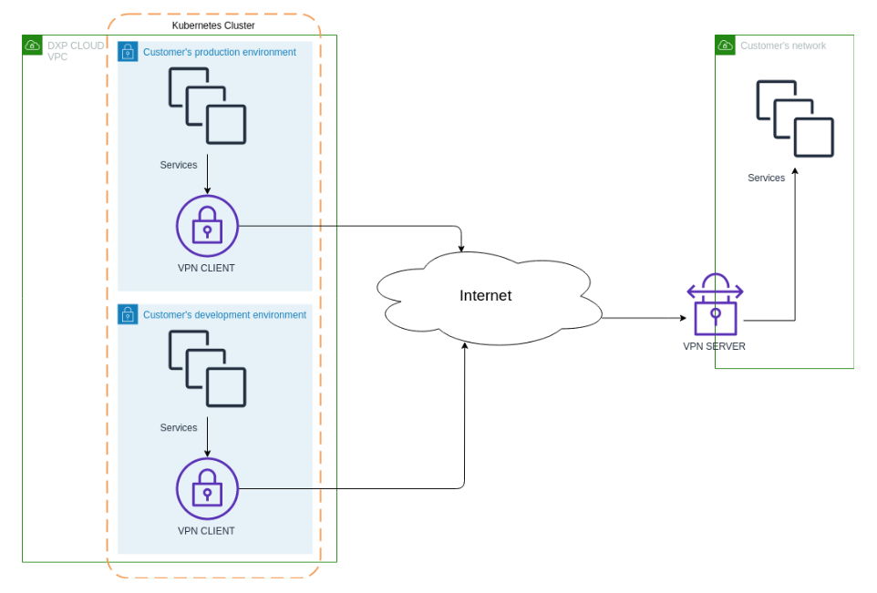

---
taxonomy-category-names:
- Cloud
- Cloud Platform Administration
- Cloud Platform Networking
- Liferay PaaS
uuid: 0699fcf8-e695-4cad-af15-f136c02f4284
---
# VPN Integration Overview

Liferay Cloud provides a VPN client-to-site connection that has port forwarding and redundant tunnels support. This feature is commonly used to connect a subscriber's production environment on Liferay Cloud to their internal network. For security and reliability, these VPN connections are segregated for each environment (production, staging, or development).



Subscribers can use redundant VPN tunnels by mapping their connections between their Liferay Cloud services to their corresponding VPN server's IP addresses. The redundancy is placed in different availability zones to provide resiliency. The client-to-site approach covers connecting to a service running on the company network. This model is recommended for the containerized architecture and Kubernetes network layer provided.

Once a VPN connection is configured, you can view log messages from the VPN server from your environment's Logs page by selecting *VPN Logs* from the dropdown list.


See the [VPN server limitations](../../reference/platform-limitations.md#vpn-servers) section for more information.

## Configuration

The client to site VPN feature supports the following protocols:

* IPsec (IKEv2)
* OpenVPN

Subscribers can choose one of the protocols (IPSec or OpenVPN) to perform the connection from Liferay Cloud console settings page for the desired environment. Any number of forwarding ports can be configured for the connection in the console UI.

```{note}
Using the `IKEv2` protocol with an IPsec server, you can either use `MSCHAPv2` or `TLS` authentication protocols. See [Basic Setup for an IPsec Server](./configuring-a-vpn-server.md#basic-setup-for-an-ipsec-server)_ for more information.
```

See [Connecting a VPN Server to Liferay Cloud](./connecting-a-vpn-server-to-liferay-cloud.md) for more information.

## Connecting Liferay Cloud to an IPSec VPN Server

In this use case, assume there is a Liferay Portal instance running inside Liferay Cloud and needs to access an HTTP service running inside an internal network.


Note the following:

* The Hello World service on `192.168.100.30:8080` running inside the customer's internal network is accessible from the Liferay Portal service via the server address `vpn:33000`.
* The client-to-server connection is made through the customer's VPN server running on `18.188.145.101:500`.
* The port forwarding rule exposes the local port **33000** which maps to the application running on `192.168.100.30:8080`.

After the connection and port forwarding rule are configured, requests to the Hello World service can be made from any Liferay Cloud service.

```bash
curl vpn:33000

<body><h1>Hello world!</h1></body></html>
```

### Liferay Cloud IP Ranges for Shared Cluster

Liferay Cloud uses a broad range of available IP addresses which can be mapped to a VPN server. By default all outgoing external IP addresses for the Liferay Cloud services are not fixed.

The best way to get stable outgoing external IP addresses is to use the Liferay Cloud Private Cluster feature.

### Liferay Cloud IP Ranges for Private Cluster

Liferay Cloud offers optional Private Clusters which isolate each subscriber's services into their own dedicated cluster. Each cluster is configured with a dedicated gateway for all outbound Internet traffic from the subscriber's cluster and is assigned a static external IP.

## What's Next

* [Configuring a Client-to-Site VPN example](./configuring-a-vpn-server.md)
