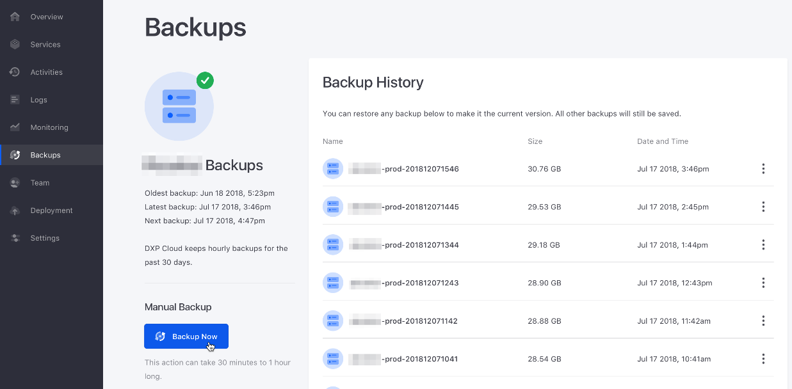
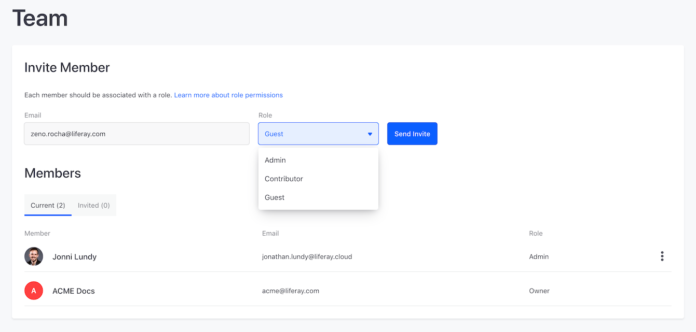
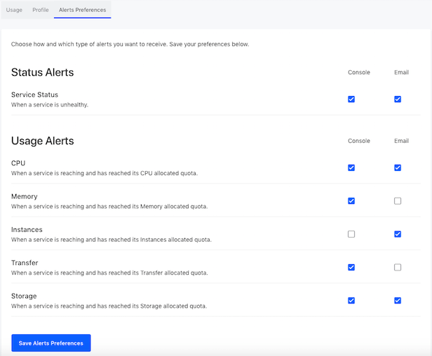
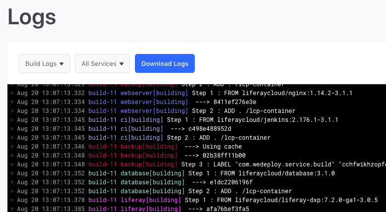
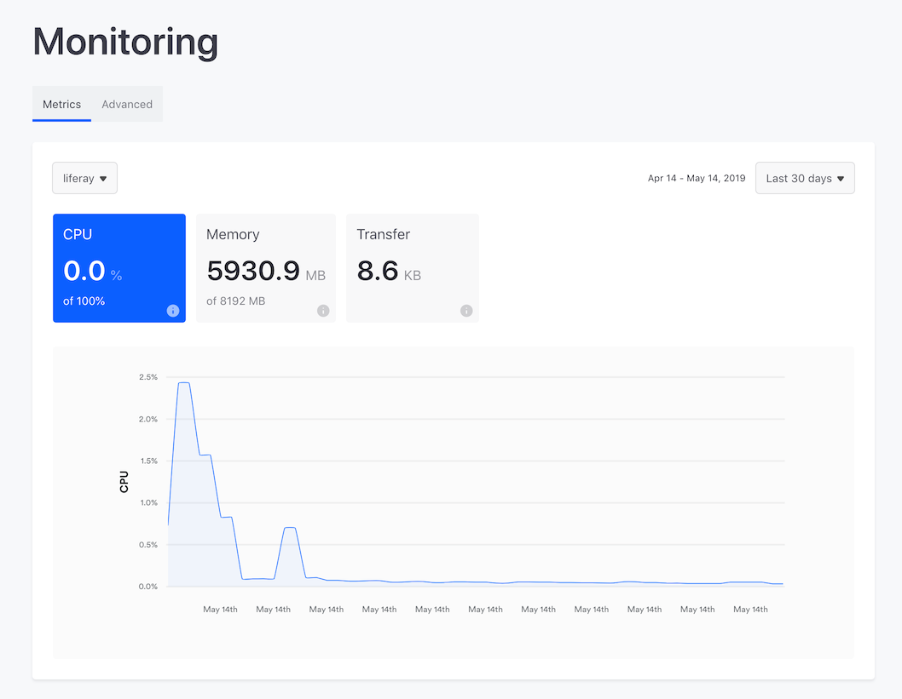

---
toc:
  - ./getting-started/initial-setup-overview.md
  - ./getting-started/development-requirements.md
  - ./getting-started/configuring-your-github-repository.md
  - ./getting-started/configuring-your-bitbucket-repository.md
  - ./getting-started/configuring-your-gitlab-repository.md
  - ./getting-started/logging-into-your-liferay-cloud-services.md
  - ./getting-started/understanding-liferay-cloud-environments.md
  - ./getting-started/liferay-saas-go-live-checklist.md
  - ./getting-started/liferay-paas-go-live-checklist.md
taxonomy-category-names:
- Cloud
- Cloud Platform Administration
- Liferay PaaS
- Liferay SaaS
uuid: 7197d494-7d76-48f5-ab9b-a8efa9441400
---
# Getting Started

Liferay Cloud is a secure and reliable enterprise cloud platform that provides the infrastructure and tooling necessary to simplify, secure, and deliver amazing applications on Liferay DXP.

There are two Liferay Cloud offerings:

* **Liferay SaaS**: Liferay’s flexible, Digital Experience, Software-as-a-Service offering to create, launch, and optimize digital solutions quickly and conveniently. Updating, patching, and managing Liferay DXP and the other core Liferay Cloud services is part of the package, so you only need to worry about your own [customizations](#customizing-liferay-with-client-extensions).

* **Liferay PaaS**: Manage and configure your own Liferay Cloud services to use Liferay DXP in a secure cloud environment. Directly manage and maintain the core Liferay Cloud services in addition to your customizations.

Worry less and build more with a platform that provides

* [Standards-Compliant Security and Networking Capabilities](#standards-compliant-security-and-networking-capabilities)
* [Data Recovery and Automated Backups](#data-recovery-and-automated-backups)
* [Team Management](#team-management)
* [High Availability, Scalability, and Performance](#high-availability-scalability-and-performance)
* [Real-Time Alerts](#real-time-alerts)

All of these features are designed, built, and supported by a dedicated team of Liferay professionals with over a decade of experience running business-critical solutions on Liferay DXP.

The *Liferay Cloud console* is your main tool to monitor and manage your [customizations](#customizing-liferay-dxp-with-client-extensions) or (for Liferay PaaS) the core Liferay Cloud services. Through the console, every Liferay Cloud project gives you a set of [application development tools](#application-development-tools) to monitor or troubleshoot the services you manage.

Liferay PaaS accelerates application development and deployment by providing a complete DevOps CI/CD strategy, tools, and workflow. These tools allow you to fine-tune each cloud service by deploying them from your own [code repository](./getting-started/initial-setup-overview.md#access-the-provisioned-project-source-code).

Every Liferay PaaS project also comes with

* [Accelerated Development with Built-in CI/CD](#accelerated-development-with-built-in-cicd)
* [Insightful Monitoring](#insightful-monitoring)

## Standards-Compliant Security and Networking Capabilities

Liferay Cloud is designed with security in mind. Build and deploy mission-critical sites with confidence knowing that Liferay Cloud is **ISO 27001** and **AICPA SOC2** certified. Liferay SaaS is also **ISO 27017** and **ISO 20718** certified.

All customer data is encrypted at rest by default (with the advanced AES-256 standard). Encryption at rest ensures that sensitive data saved on disks isn't readable by any user or application without a valid key. Data is protected in transit with enforced SSL connections, which also employ a minimum of AES-256 encryption. See our [security policy](https://www.liferay.com/documents/10182/3292406/Liferay+DXP+Cloud+Data+Security+and+Protection.pdf/78ce7065-9787-1fb2-9c7b-6d7c13f4a3e6?t=1564674972483) for more information.

Liferay SaaS comes with a Web Application Firewall (WAF) by default. The WAF helps detect and prevent web-based threats from impacting your sites. You can also [open a Support ticket](./support-and-troubleshooting/liferay-cloud-support.md#opening-a-support-ticket) to request filtering specific IP addresses or ranges. The same WAF is also available in Liferay PaaS, but [you must enable and configure it](./tuning-security-settings/web-application-firewall.md) to suit your needs.

### VPN Integration

You can also connect systems outside of Liferay Cloud to your instance (for example, an LDAP server) with a client-to-site Virtual Private Network (VPN). Liferay Cloud supports integration with OpenVPN or IPSec IKEv2 protocols, allowing for high-grade encryption and advanced VPN security features.

With Liferay SaaS, connect a VPN to your Liferay DXP instance by [opening a Support ticket](./support-and-troubleshooting/liferay-cloud-support.md#opening-a-support-ticket) with the VPN's information. You can also connect a VPN to client extension services yourself by [using the Liferay Cloud console](./configuring-the-cloud-network/connecting-a-vpn-server-to-liferay-cloud.md).

With Liferay PaaS, connect a VPN to your cloud services by [configuring and connecting the VPN yourself](./configuring-the-cloud-network/vpn-integration-overview.md).

## Data Recovery and Automated Backups

[Automated backups](./platform-services/backup-service/backup-service-overview.md) ensure that data and documents are protected and ready for restoration in case of data corruption or failure.

With Liferay SaaS, Liferay's team automatically backs up your data on a regular interval. To protect customer data, backups are restricted to [the cloud instance's data region](./reference/liferay-cloud-data-center-locations.md) and is never transported outside of it. Request a manual backup, a backup restore, or a copy of your data by [opening a Support ticket](./support-and-troubleshooting/liferay-cloud-support.md#opening-a-support-ticket).

With Liferay PaaS, you can [fine-tune your automated update schedule](./platform-services/backup-service/backup-service-overview.md#scheduling-automated-backups-and-cleanups) and [restore data from backups](./platform-services/backup-service/restoring-data-from-a-backup.md) yourself when necessary.

## Team Management

Out-of-the-box [role and team administration](./manage-and-optimize/environment-teams-and-roles.md) allows administrators to deliver maximum productivity and security by adding or removing people from teams and managing permissions per project environment.

## High Availability, Scalability, and Performance

Liferay Cloud is committed to maintaining as close to 100% uptime as possible, and its systems have enjoyed an aggregate of over 99.9% uptime each quarter since its release in 2019.

Liferay Cloud databases are configured with Multi-Availability Zone (Multi-AZ) environments. This ensures that data is replicated in different secure, isolated locations, so it isn't vulnerable to a single point of failure. Subscription plans for Liferay SaaS and PaaS may also employ multiple instances of Liferay DXP, search engine, and web server services to ensure high availability and reduce the possibility of interruptions or downtime.

[Clustering](./customizing-liferay-dxp-in-the-cloud/using-the-liferay-dxp-service/setting-up-clustering-in-liferay-cloud.md) and [load-balancing](./configuring-the-cloud-network/load-balancer.md) deliver highly available, zero-downtime deployments to ensure that mission-critical sites stay online. Liferay Cloud delivers data through a multi-region architecture to ensure high availability.

[Auto-scaling](./manage-and-optimize/auto-scaling.md) ensures that bandwidth and computing capacity is dynamically added to maintain steady performance through unexpected traffic spikes. Similarly, unneeded resources can be scaled down during periods of lower activity. Teams receive automatic notifications and email alerts regarding instance usage so they can manage resources with confidence.

With Liferay SaaS, these features function automatically within the storage and CPU limits of your subscription plan. With Liferay PaaS, you must [configure clustering](./customizing-liferay-dxp-in-the-cloud/using-the-liferay-dxp-service/setting-up-clustering-in-liferay-cloud.md) and [auto-scaling](./manage-and-optimize/auto-scaling.md#managing-auto-scaling) yourself.

## Real-Time Alerts

Administrators can configure [alerts](./manage-and-optimize/real-time-alerts.md) per user to receive resource utilization updates in real-time.

## Accelerated Development with Built-in CI/CD

With Liferay PaaS, deliver your application faster with a fully-realized CI/CD strategy available out-of-the-box. [GitHub and Jenkins](./platform-services/continuous-integration.md) integrations allow each new commit or pull request to trigger a build that can be deployed to your [production or non-production environments](./getting-started/understanding-liferay-cloud-environments.md). Each build can tweak your [core Liferay Cloud services](./platform-services.md) or customize Liferay DXP itself.

These robust systems enable the creation of fault tolerant processes to meet organizations' unique needs and detect and repair common server problems as they occur. This helps prevent small programming errors from accumulating and causing a server crash.

## Application Development Tools

Keep track of application deployments and performance with real-time build and [deployment logs](./support-and-troubleshooting/troubleshooting/reading-liferay-cloud-service-logs.md) for your client extensions. You can also use Liferay Cloud's [command-line tool](./reference/command-line-tool.md#showing-the-service-logs) to view Liferay DXP logs (or other core service logs, with Liferay PaaS).

Teams can also analyze stack traces and troubleshoot bugs with [client extensions](#customizing-liferay-with-client-extensions) (or, in Liferay PaaS, any core Liferay service) by [accessing a shell](./support-and-troubleshooting/troubleshooting/shell-access.md) via the web console or terminal, and/or by downloading the logs.

## Insightful Monitoring

Liferay PaaS delivers [application metrics](./manage-and-optimize/application-metrics.md) so IT teams can understand the health and computing requirements of their sites over time. Administrators can also use out-of-the-box [Dynatrace integration](./manage-and-optimize/application-metrics.md#advanced-application-metrics-production-only) to quickly understand CPU and memory usage, data transfer rates, and more.

!!! note
    With Liferay SaaS, Liferay Cloud's team monitors your environment regularly to respond incidents whenever necessary. The team can respond to unresponsive or offline sites, as well as signs or trends that can cause downtime in the future. The team contacts you if a situation requires your own intervention. You can also stay up-to-date on the status of Liferay Cloud's systems on the [Status page](https://status.liferay.cloud/).

## Customizing Liferay DXP with Client Extensions

You can customize your site's features using client extensions, without altering Liferay DXP's code. Client extensions interface with Liferay's API's, promoting flexibility and compatibility with different versions of Liferay.

You can manage client extensions in Liferay SaaS or PaaS from the Liferay Cloud console. Because client extensions are purely a method of customization, you must manage the code yourself (via a [Liferay workspace](https://learn.liferay.com/web/guest/w/dxp/building-applications/tooling/liferay-workspace/what-is-liferay-workspace), and *Liferay cannot guarantee support* for issues that may arise with them.

!!! note
    You can deploy as many client extensions as needed up to the resource limit for your subscription plan. You cannot deploy more client extensions if you have already allocated all of your available resources for other services.

## Related Topics

* [Development Requirements](./getting-started/development-requirements.md)
* [Configuring Your GitHub Repository](./getting-started/configuring-your-github-repository.md)
* [Overview of the Liferay Cloud Deployment Workflow](./updating-services-in-liferay-paas/overview-of-the-liferay-cloud-deployment-workflow.md)
* [Deploying Changes via the Liferay Cloud Console](./updating-services-in-liferay-paas/deploying-changes-via-the-liferay-cloud-console.md)
