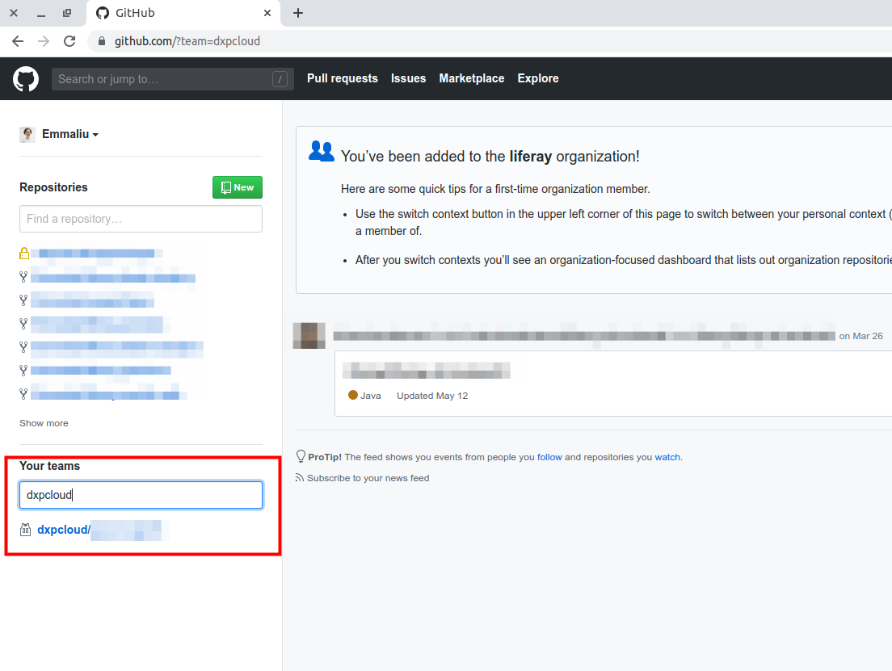
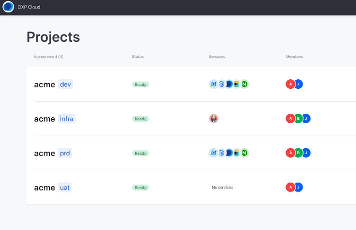
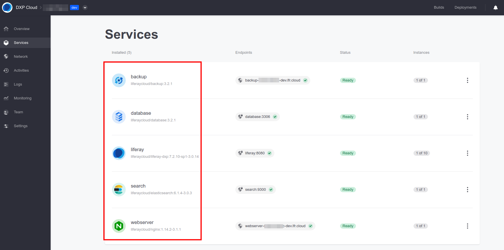

# Initial Setup Overview

Getting started with Liferay Cloud involves ensuring all accounts, environments, and services have been successfully provisioned and deployed in your instance. Begin with the following steps:

- [Check Setup Emails](#check-setup-emails)
- [Access the Liferay Cloud Console](#access-the-liferay-cloud-console)
- [Access the Provisioned Project Source Code](#access-the-provisioned-project-source-code)
- [Log into Your CI and Liferay Services](#log-in-to-your-ci-and-liferay-services)
- [Verify Setup](#verifying-setup)

## Check Setup Emails

Check the email account associated with your Liferay Cloud subscription for setup emails. You should receive a Liferay Cloud onboarding email along with email invitations for each purchased Liferay Cloud environment.

The onboarding email provides necessary credentials for accessing Jenkins and Liferay DXP on non-production environments, as well as important steps for getting started with Liferay Cloud.

Each environment invitation grants access to a single purchased Liferay Cloud environment. Be sure to accept all environment invitations.

## Access the Liferay Cloud Console

Returning users can [log into the Liferay Cloud Console](https://console.liferay.cloud/login) using their existing accounts. New users must [create an account](https://console.liferay.cloud/signup?undefined) using the email account associated with the Liferay Cloud subscription.

After logging in, the Liferay Cloud Console [home page](https://console.liferay.cloud/projects) appears.


From here, you can access and manage environments and deployments, as well as invite other team members.

## Access the Provisioned Project Source Code

New Liferay Cloud projects are provisioned a temporary GitHub repository hosted in the `dxpcloud` organization. This repository contains the template for a Liferay Cloud development project.

To access to your new project repository, follow the instructions in the Liferay Cloud onboarding email and accept the subsequent GitHub invitation.

After accepting the invitation, locate your provisioned project repository:

1. Log into GitHub.

1. Search `dxpcloud` in the _Your teams_ search box.



Once you have found your provisioned repository, you must:

1. Transfer the provisioned repository's content to a private Git repository.

1. Integrate the private repository with the Jenkins (CI) service in Liferay Cloud using a Webhook.

See [Configuring Your GitHub Repository](./configuring-your-github-repository.md) for detailed instructions.

```{note}
Using an alternative hosting service? See how to configure your [Bitbucket](./configuring-your-bitbucket-repository.md) or [GitLab](./configuring-your-gitlab-repository.md) repositories.
```

## Log into Your CI and Liferay Services

Log into the Jenkins (CI) web interface, then log into your Liferay DXP instance's non-production environments (e.g., *dev* and *uat*) so you can access them.

Login credentials are provided in the initial onboarding email, and listed as [secrets](../infrastructure-and-operations/security/managing-secure-environment-variables-with-secrets.md) in your *infra* environment.

See [Logging into Your Liferay Cloud Services](./logging-into-your-liferay-cloud-services.md) for detailed instructions.

## Verifying Setup

Before beginning deployment in Liferay Cloud, verify that the correct environments and services have been successfully provisioned and deployed.

### Verifying Environments

Verify all purchased environments are listed in the Liferay Cloud Console [home page](https://console.liferay.cloud/projects) under *Projects*.



If any environments are missing after you've accepted all environment invitations, please contact the Liferay Support team.

### Verifying Environment Locations

Verify that the location for each environment matches the location requested by your team.

All environment locations are listed on the Liferay Cloud Console [home page](https://console.liferay.cloud/projects).

You can also view an environment's location by navigating to its *Overview* page or *Settings* page.


If the environment location does not match the location requested by your team, please [contact the Liferay Support team](https://help.liferay.com/hc/en-us/articles/360030208451-DXP-Cloud-Support-Overview).

### Verifying Cloud Stack Services

Verify the Liferay Cloud stack services are properly deployed:

1. Access the *dev* environment from the Liferay Cloud Console.

1. Navigate to the *Services* page.



When properly deployed, the status of all 5 default Cloud Stack services should be 'Ready'.

## Related Topics

- [Configuring Your GitHub Repository](./configuring-your-github-repository.md)
- [Understanding Liferay Cloud Environments](./understanding-liferay-cloud-environments.md)
- [Logging into Your Liferay Cloud Services](./logging-into-your-liferay-cloud-services.md)
