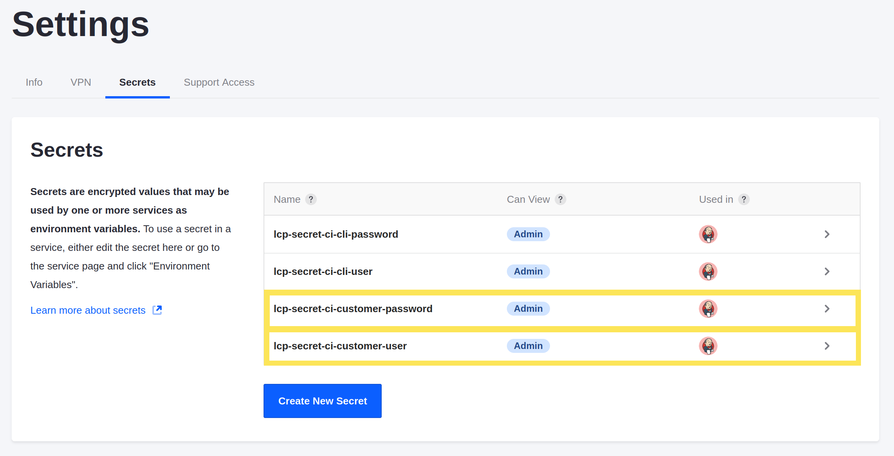
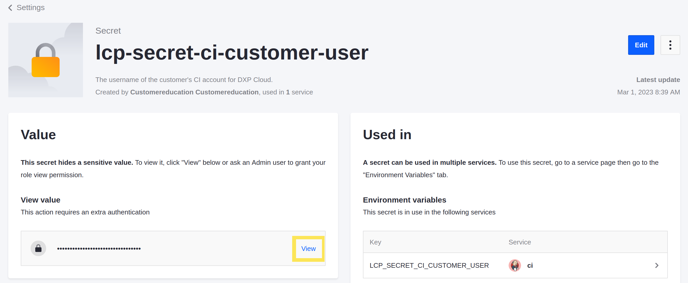
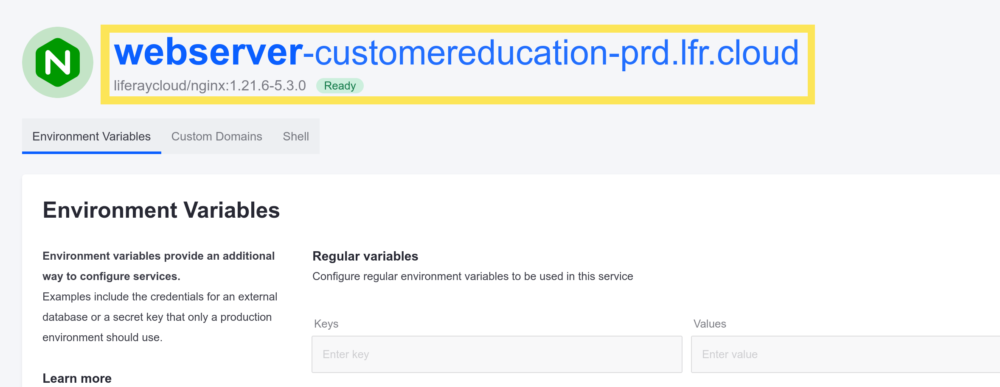

# Logging into Your Liferay Cloud Services

By default, login is required to directly access the web interfaces for the Liferay and Infrastructure services on any non-production environment (e.g., uat). Login credentials for these services are typically provided in an initial onboarding email, but they are also located in the Liferay Cloud Console.

## Locating Login Credentials

1. Navigate to the _infra_ environment.

1. Click _Settings_ in the left menu.

1. Click the _Secrets_ tab.

1. Click the `lcp-secret-ci-customer-user` and `lcp-secret-ci-customer-password` secrets to access them.

    

1. For each secret, click *View* on the secret's page to reveal the value. You can click on the value once it's revealed to copy it to your clipboard.

    

## Logging In

1. Navigate to your chosen environment (_dev_, _uat_, etc.).

1. Click the *Visit Site* dropdown menu at the top of the page.

    

    The dropdown menu lists all of the available endpoints to your `liferay` service you can access, including the default `webserver` service endpoint and any custom domains you have added to the environment.

1. Click on the desired endpoint to access your Liferay instance with the corresponding URL.

1. Enter the Liferay Cloud [Jenkins user name and password](#locating-login-credentials) when prompted.

    

This redirects the user to the Liferay DXP 7.x instance (in this example, Liferay DXP 7.2 GA1).

### Finding Default Service URLs

You can also find the default `webserver` endpoint's URL by navigating to the service's page and clicking on the `webserver` logo at the top of the page (which expands into a URL):

Your [Jenkins login credentials](#locating-login-credentials) are still required when accessing Liferay through this method.

You can follow similar steps to access the Jenkins CI web interface. Navigate to the `ci` service in the `infra` environment to find the Jenkins URL:

## Additional Information

* [Using the Liferay DXP Service](../using-the-liferay-dxp-service.md)
* [Continuous Integration](../platform-services/continuous-integration.md)
* [Web Server Service](../platform-services/web-server-service.md)
