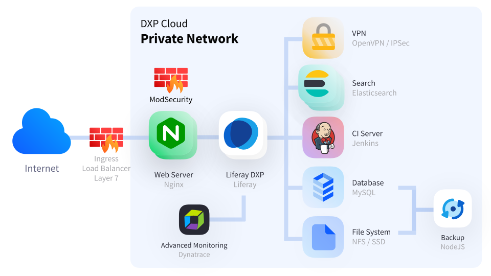

# Web Application Firewall

{bdg-secondary}`Available in DXP Cloud 5.x.x`

ModSecurity is a Web Application Firewall available in DXP Cloud that inspects requests sent to the web server in real time, against a predefined set of custom rules. This step prevents typical web application L7 attacks, like XSS, SQL Injection, and other forms of hijacking attempts that might lead to loss of sensitive information.

DXP Cloud also includes a number of other network security features, including a [private network](../networking/private-network.md), Public [Load Balancer](../networking/load-balancer.md) ([Layer 7](https://www.nginx.com/resources/glossary/layer-7-load-balancing/)), and [CDN](../networking/load-balancer.md#cdn).



```{note}
Custom firewall rules are not available with [shared cluster subscriptions](../../reference/platform-limitations.md#security).
```

## Enabling ModSecurity

ModSecurity is disabled by default. To enable it, add the `LCP_WEBSERVER_MODSECURITY` [environment variable](../../platform-services/web-server-service.md#environment-variables) to your project repository's `webserver/LCP.json` file. Any attack detection rules are only processed if ModSecurity is enabled. *You must [add your own rules](#adding-attack-detection-rules).*

These values are allowed for `LCP_WEBSERVER_MODSECURITY`:

* **On**: enables ModSecurity. Rules are processed.

* **Off**: disables ModSecurity. Rules are not processed.

* **DetectionOnly**: enables ModSecurity. Rules are processed, but they do not execute any disruptive actions (block, deny, drop, allow, proxy, or redirect).

```{tip}
The `LCP_WEBSERVER_MODSECURITY` environment variable is equivalent to ModSecurity's own [`SecRuleEngine` directive](https://github.com/SpiderLabs/ModSecurity/wiki/Reference-Manual-%28v3.x%29#SecRuleEngine).
```

If you set the value of `LCP_WEBSERVER_MODSECURITY` to **On** or **DetectionOnly**, ModSecurity is automatically enabled when you [deploy the change](../../build-and-deploy/deploying-changes-via-the-cli-tool.md).

## Changing ModSecurity's Configuration

By default, ModSecurity uses recommended settings when it is [enabled](#enabling-modsecurity). However, if you want to override the default configuration, then you must create a `modsecurity.conf` file in your project repository's `webserver/configs/{ENV}/modsec/` directory. You must provide all of the necessary configurations in this file, because it completely overrides Liferay Cloud's default `modsecurity.conf`.

You can copy [this example of recommended settings](https://github.com/SpiderLabs/ModSecurity/blob/v3/master/modsecurity.conf-recommended) as a starting point for your own `modsecurity.conf` file. However, if you use this file then you must replace the line `SecRuleEngine DetectionOnly` with this line:

```
SecRuleEngine ${LCP_WEBSERVER_MODSECURITY}
```

See the [ModSecurity Reference Manual](https://github.com/SpiderLabs/ModSecurity/wiki/Reference-Manual-%28v3.x%29) for more information on the allowed settings.

## Adding Attack Detection Rules

Attack detection rules are not provided by default. In using ModSecurity, you are responsible for providing your own rules according to your specific needs.

### OWASP ModSecurity Core Rule Set

The OWASP Foundation's ModSecurity Core Rule Set (CRS) is the recommended rule set for use with Liferay Cloud. You can download the OWASP CRS [here](https://coreruleset.org/installation/).

Follow these steps to add the OWASP CRS to ModSecurity:

1. Unzip the files and place them in this folder in your project repository: `webserver/configs/{ENV}/modsec/rules/`

1. Move the `crs-setup.conf.example` file to the `webserver/configs/{ENV}/modsec/` folder.

1. Rename `crs-setup.conf.example` to `crs-setup.conf`.

1. Open the `crs-setup.conf` file and add this to the last line of the file:

```
/etc/nginx/modsec/rules/*.conf
```

1. Commit the files to your repository and [deploy the changes](../../build-and-deploy/deploying-changes-via-the-cli-tool.md).

This adds the rule set to be interpreted when you [enable ModSecurity](#enabling-modsecurity).

## Using ModSecurity Audit Logs

When [ModSecurity is enabled](#enabling-modsecurity), it automatically generates audit logs that record detailed information for all transactions. This information is saved in the `modsec_audit.log` file in your web server's `/var/log` directory.

If you have [configured ModSecurity by providing your own `modsecurity.conf` file](#changing-modsecurity-s-configuration), you can make this information display in the web server's console (where you can download it) instead of `modsec_audit.log`. To do this, change this line in your `modsecurity.conf` file:

```
SecAuditLog /var/log/modsec_audit.log
```

Replace `/var/log/modsec_audit.log` with `/dev/stdout` to have audit logs display in the console. The audit logs appear in the console with each transaction once you deploy the change.

You can also change the audit log format to JSON by adding this line to the `modsecurity.conf` file:

```
SecAuditLogFormat JSON
```

## Additional Information

* [Private Network](../networking/private-network.md)
* [Load Balancer](../networking/load-balancer.md)
* [CDN](../networking/load-balancer.md#cdn)
