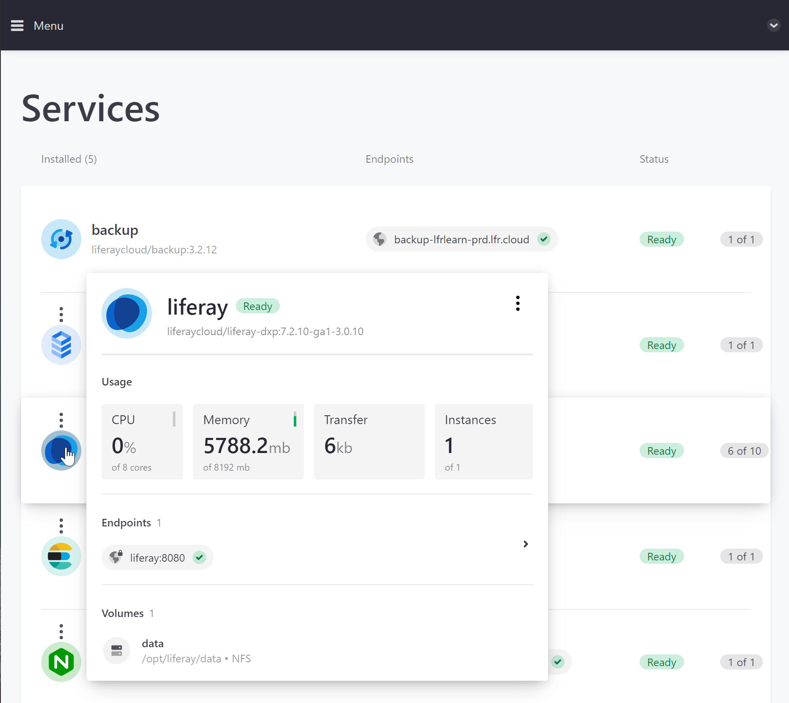
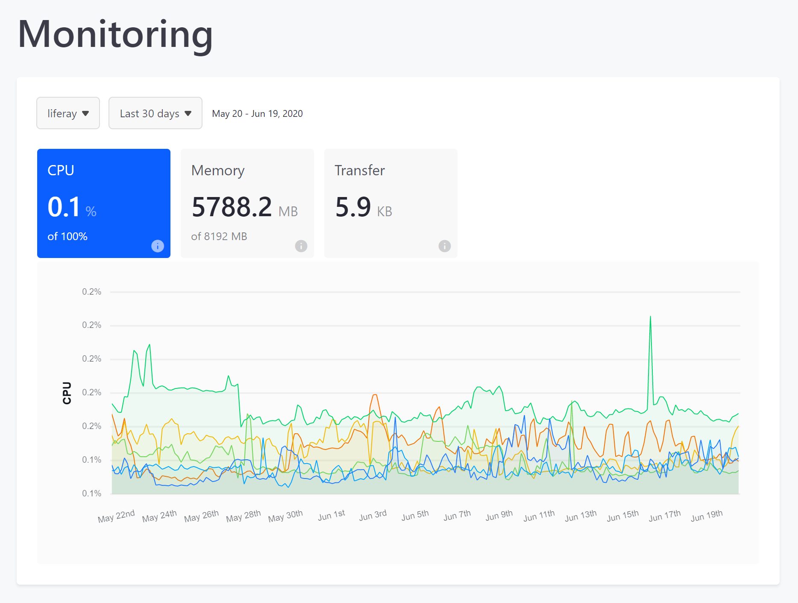
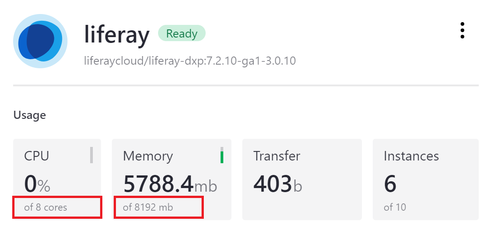
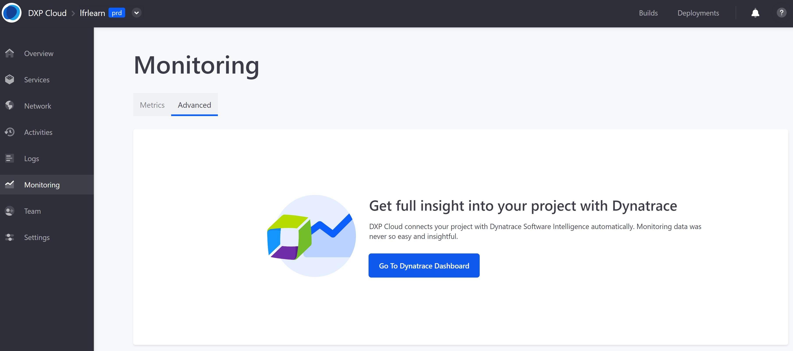

# Application Metrics

With Liferay Cloud's built-in monitoring, you can track resources used by each environment service. These application metrics include memory and CPU usage, as well as network data transfer. Metrics are available for the default Liferay Cloud stack services: Webserver, Liferay, Search, Database, and Backup.

## Service Popover

You can quickly see a service's current resource usage from several pages in your Liferay Cloud environment, including the environment's _Overview_ and _Services_ pages, and the individual service pages. View a popover of any service's resource usage by hovering over the service's icon.



## Extended Application Metrics

Users can view extended service metrics from the *Monitoring* page:

1. Click *Monitoring* in the environment menu.
1. Use the drop-down menus to select the service and time frame you want to monitor.



Users can also view extended service metrics from the *Services* page:

1. Click *Services* in the environment menu.

1. Click on the *Service* you want to monitor.

1. Click on the *Metrics* tab.



## Determining Resources Allocated to Services

A service's `LCP.json` file configuration determines the total memory and CPUs allocated to that service, and the application metrics show the usage of those resources over time.

Here is an example of CPU and Memory allocation for the `liferay` service in its `LCP.json` file:

```
"id": "liferay",

"memory": 8192,
"cpu": 8
```

Users can view allocated resources from the Liferay Cloud console.



## Advanced Application Metrics (Production Only)

With Liferay Cloud, you can integrate [Dynatrace's](https://www.dynatrace.com/) advanced performance monitoring with your production environments.

See the [Dynatrace limitations](../reference/platform-limitations.md#dynatrace) for more information.

### Integrating Dynatrace with Production Environments

Follow these steps to integrate Dynatrace:

1. Create a Dynatrace account.

1. Generate the Dynatrace secret `token` and `tenant` values.

1. Add the Dynatrace `token` value as a [Secret](../infrastructure-and-operations/security/managing-secure-environment-variables-with-secrets.md) for the Liferay service.

1. Add the Dynatrace `tenant` Dynatrace environment variables to the `LCP.json` file in the Liferay service's production environment. For example:

```json
{
	"environments": {
	  "prd": {
	    "env": {
	      "LCP_PROJECT_MONITOR_DYNATRACE_TENANT": "tot02934"
	    }
	  }
	}
}
```

| Name | Description |
| :--- | :--- |
`LCP_PROJECT_MONITOR_DYNATRACE_TENANT` | A string of characters that is part of the URL (prefix) of your Dynatrace SaaS account. |
`LCP_PROJECT_MONITOR_DYNATRACE_TOKEN` | A string of characters that you can find in your Dynatrace account. To get the token, navigate to *Manage* &rarr; *Deploy Dynatrace* &rarr; *Set up PaaS Integration*, then enter the environment ID and click *Generate new token*. |

See the [official Dynatrace documentation](https://www.dynatrace.com/support/help/dynatrace-api/basics/dynatrace-api-authentication/) for more information about these values.

### Accessing Dynatrace

Now you can access Dynatrace's advanced performance monitoring from the Liferay Cloud console:

1. Navigate to a production environment.

1. Click *Monitoring* in the environment menu.

1. Click the *Advanced* tab.

1. Click the *Go to Dynatrace Dashboard* button to access your Dynatrace dashboard.

	

Log in with your Dynatrace credentials to check log trails and create custom dashboards.

## Related Topics

* [Using the Liferay DXP Service](../using-the-liferay-dxp-service.md)
* [Real-Time Alerts](./real-time-alerts.md)
* [Quotas](./quotas.md)
