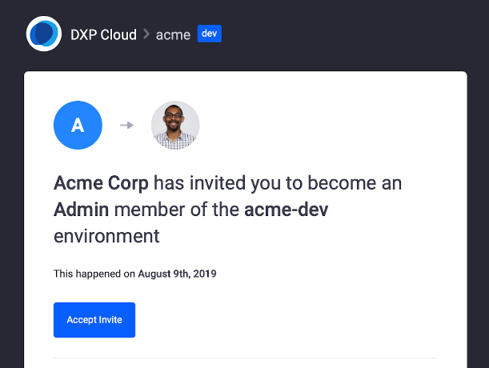
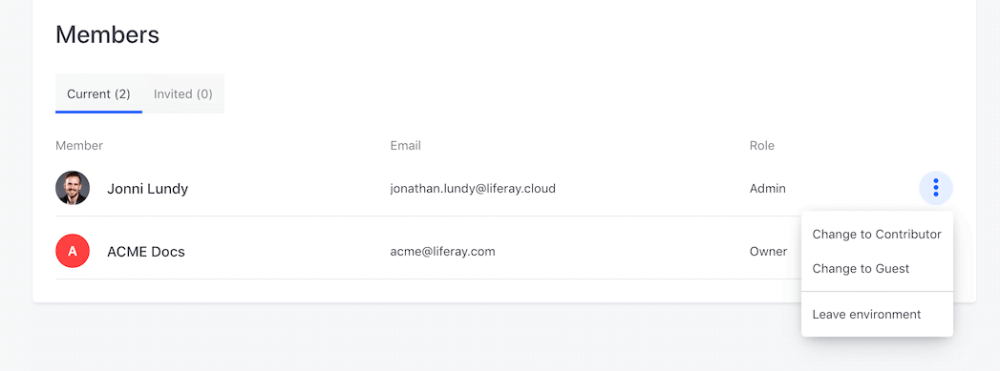

---
taxonomy-category-names:
- Cloud
- Cloud Platform Administration
- Liferay PaaS
uuid: 4a0b1b87-a50c-4d82-97ed-68f46190d9a5
---
# Environment Teams and Roles

Administrators can manage team members and roles in each project environment using the Liferay Cloud Console. Each environment can have unique members, and each member can have different roles in different environments.

Invite members and assign roles with varying access levels to achieve your desired team structure in each project environment.

## Inviting Team Members

Follow these steps to invite users to your environment:

1. Navigate to a project environment.

1. Click on *Team* in the environment menu.

1. Enter the user's email into the *Email* field.

1. Click the drop-down *Role* menu to assign a role to the new user.

1. Click on *Send Invite*.


Email invitations grant users access to a single project environment. Invited users must open the invitation email and click *Accept Invite*.



New Liferay Cloud users must create an account, while returning users can *Log in* using their Liferay Cloud credentials.

```{note}
Any user can access the Team page to see other users in the environment and their roles, including the administrators.
```

## Managing Team Members

Current and invited team members appear in separate tabs of the *Members* section. Here administrators can manage team members via the *Actions* button in each tab.

From the *Invited* tab, administrators can cancel pending environment invitations.

   

From the *Current* tab, administrators can change team member roles or remove a member from the environment.

   

## Understanding Team Roles

Roles determine a user's access level within an environment. Liferay Cloud comes with four default user roles:

* **Owner:** The sole owner of the project has the most complete access.
* **Administrator:** Administrators have full control over Liferay Cloud environments and their members.
* **Contributor:** Contributors can handle application management and most of the development life cycle, but they can't manage team members or perform other administrator-exclusive actions.
* **Guest:** Guests have view-only access. Guests can see what is happening in the environment, but can't perform actions or make any changes. They only have permission to remove themselves from the environment.

Here is a list of important permissions and which team roles have them:

| **Permission** | **Owner** | **Administrator** | **Contributor** | **Guest** |
| --- | :-: | :-: | :-: | :-: |
| Inviting/removing members | &#10004; | &#10004; | X | X |
| Changing members' roles | &#10004; | &#10004; | X | X |
| Enabling/disabling support access | &#10004; | &#10004; | X | X |
| Enabling/disabling shell access | &#10004; | &#10004; | X | X |
| Deleting an environment | &#10004; | X | X | X |
| Deleting a service | &#10004; | &#10004; | X | X |
| Restarting/stopping a service | &#10004; | &#10004; | &#10004; | X |
| Deploying a build | &#10004; | &#10004; | &#10004; | X |
| Creating, viewing, or editing secrets | &#10004; | &#10004; | X | X |
| Creating a new backup | &#10004; | &#10004; | &#10004; | X |
| Uploading/downloading a backup | &#10004; | &#10004; | X | X |
| Restoring from a backup | &#10004; | &#10004; | X | X |
| Enabling/disabling auto-scaling | &#10004; | &#10004; | X | X |
| Downscaling manually | &#10004; | &#10004; | X | X |
| Changing VPN settings | &#10004; | &#10004; | &#10004; | X |

## Related Topics

* [Initial Setup Overview](../getting-started/initial-setup-overview.md)
* [Team Activities](./team-activities.md)
* [Understanding Liferay Cloud Environments](../getting-started/understanding-liferay-cloud-environments.md)
