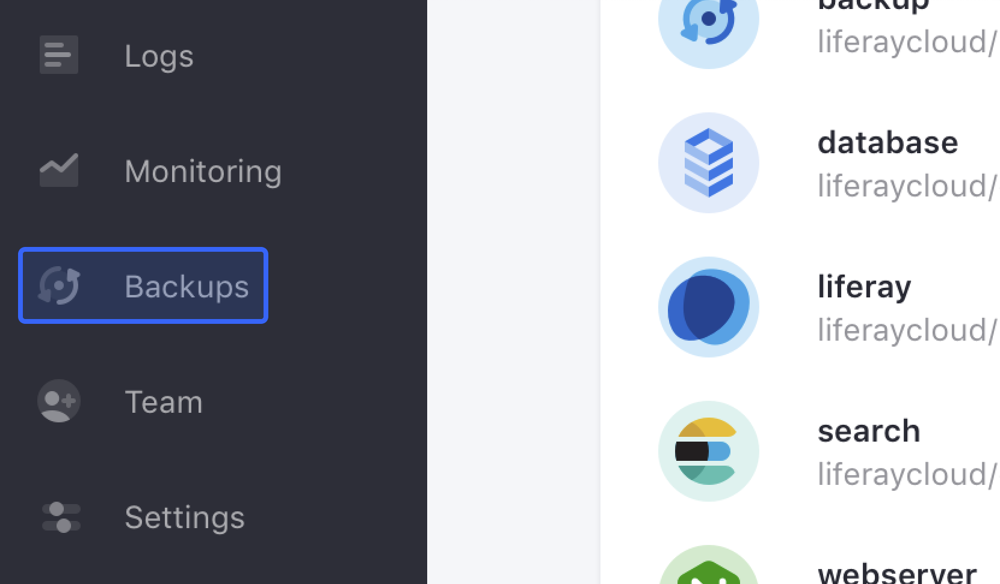
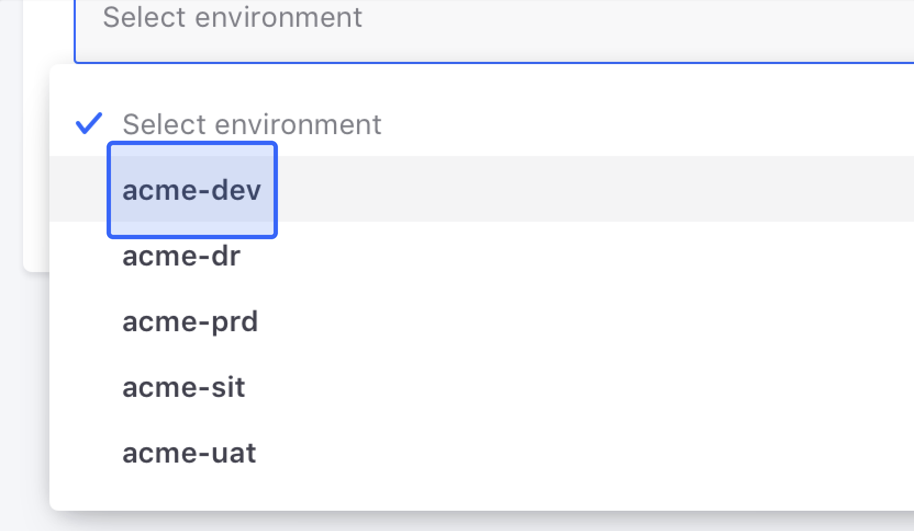

---
taxonomy-category-names:
- Cloud
- Cloud Migration
- Liferay PaaS
uuid: 80e4d534-5071-4f22-b00f-2a463d8e3e9b
---
# Stage 3: Uploading and Restoring the Data Backup

With your Liferay DXP database and document library in a compatible format, the next stage is to upload them together as a single backup to Liferay Cloud and restore them to your chosen environment.

## Upload the Backup

First, you must upload the data to the `backup` service in your chosen environment. This creates a new backup that you can then restore.

```{warning}
Uploading a backup may take minutes or hours to complete, depending on the file size and your internet connection speed. While the upload is in progress, the `backup` service cannot create, restore, or delete other backups. To avoid the process getting stuck, *do not close the window with the upload or let your device go to sleep* until it is finished.
```

Upload the backup using the Backups page.

1. In the Liferay Cloud console, navigate to your chosen environment, and click *Backups* from the menu on the left.

    

1. On the Backups page, click *Upload Backup...* at the top of the screen.

1. Add the database dump and document library archive [you created previously](./creating-data-backup-files.md) by clicking on the buttons for each.

    

    ```{note}
    The database dump and document library uploads should not exceed **2 TB** total. To upload larger files, [contact Liferay Cloud Support](https://help.liferay.com/hc/en-us/articles/360030208451-DXP-Cloud-Support-Overview).
    ```

1. Click *Initiate Upload* and wait for the upload to complete.

When the upload completes, a new backup is available at the top of the list on the Backups page with your data.

## Restore the Backup

Restore the backup created from your upload on the Backups page.

1. Click *Restore to...* from the actions menu for the correct backup.

    

1. Select the proper environment to restore the backup to from the dropdown menu.

    

    ```{warning}
     Make sure you select the correct target environment. When you restore the backup, the target environment's database and Liferay data storage are overwritten with data from the backup, and the overwrite is not reversible.
    ```

1. Click *Restore to Environment* and wait for the backup restoration to complete.

    ```{warning}
    The target environment is unavailable while the backup restoration is in progress.
    ```

When the backup restoration is complete, the target environment has the same data from the database and document library you uploaded.

```{tip}
You can check the status of your Liferay DXP instance on Liferay Cloud by clicking *Visit Site* on the top bar of the target environment.
```

## Next Steps

Now you have a Liferay instance up and running on Liferay Cloud with your data. Next, you will [migrate your configurations and customizations](./migrating-dxp-configurations-and-customizations.md) for Liferay DXP to your Cloud environment.
