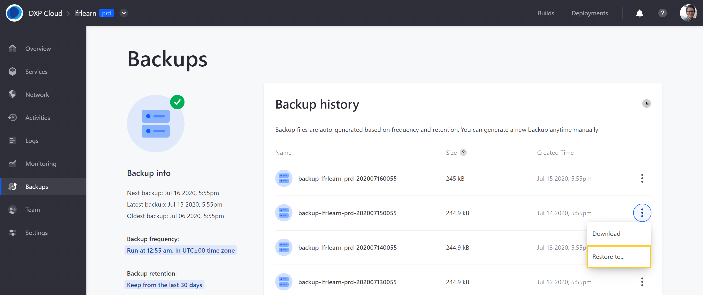
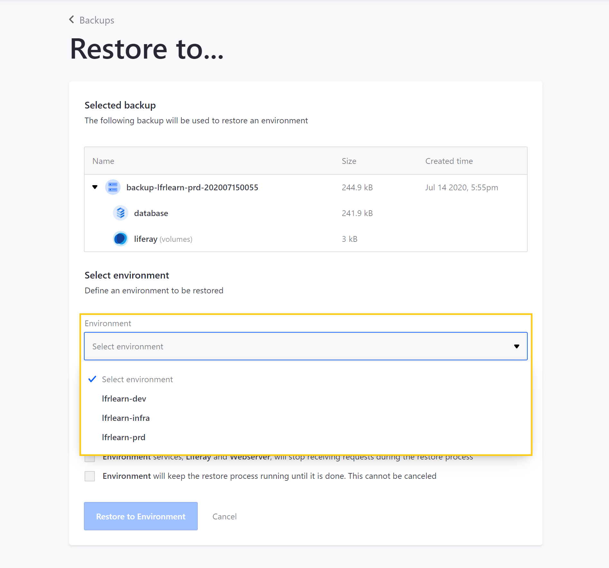
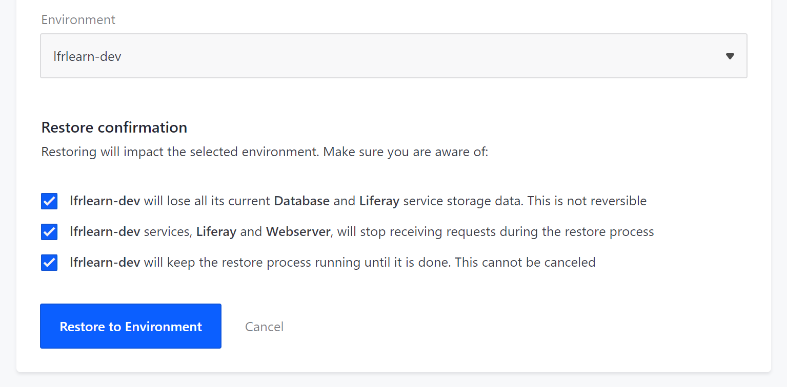

---
taxonomy-category-names:
- Cloud
- Cloud Platform Services
- Liferay PaaS
uuid: b323c5f9-5ba1-4468-8b8c-5c16c36b3078
---
# Restoring Data from a Backup

During project development, there may be times when you need to restore data or roll back the project to an earlier state. Restoring a backup to an environment restores the data for each service, but it does *not* change the build the environment is using.

You can also use custom SQL scripts to perform additional updates to a database as part of the data restore.

Restoring data from a backup results in downtime for the database service and any services that depend on it (including Liferay). However, if your backup service is at least version `5.x.x`, you can minimize the downtime by changing the default `OVERWRITE` restore behavior to `PREPARE_AND_SWAP`. This starts a separate, fresh database instance and volume and only switches to the new instance when it's ready. Set the [`LCP_BACKUP_RESTORE_STRATEGY` environment variable](./backup-service-overview.md#environment-variables-reference) to `PREPARE_AND_SWAP` to use this strategy.

See [Backup Service](./backup-service-overview.md) and [Downloading and Uploading Backups](./downloading-and-uploading-backups.md) for more information about the Backups page.

```{important}
Only users with the Admin role for the chosen environment can manually restore environments via the Liferay Cloud console.
```

## Restoring an Environment from the Backups Page

The *Backups* page of each environment has a list of all recent backups taken (automatically and manually). Restoring a backup to an environment from this page restores the data used by each service, but it does *not* change the build or Docker image that each service is using.

```{warning}
The `backup` service version of the backup you're restoring should match the target environment before the restore to ensure it completes successfully. The Liferay [fix pack level](https://learn.liferay.com/dxp/latest/en/installation-and-upgrades/maintaining-a-liferay-installation/patching-dxp-7-3-and-earlier.html) should also match to avoid causing errors with a mismatched database schema. If you restore a backup that requires a different build from what is currently deployed in the environment, then [deploy an appropriate build](../../build-and-deploy/overview-of-the-liferay-cloud-deployment-workflow.md) *before* beginning the restore.
```

Follow these steps to restore an environment from a backup:

1. Navigate to your project's chosen environment.

1. Click on Backups in the environment menu on the left side of the screen.

1. Click on the *Actions* button ( ⋮ ) for the backup you want to use to restore a project environment.

1. Click on *Restore to...*

   

1. Click the drop-down *Environment* menu, and select the environment you want to restore.

   

   ```{note}
   Administrators can only restore environments to which they have access.
   ```

1. Click all *checkboxes* that appear below. You must check these boxes to enable the button to initiate the restore.

1. Click on *Restore to Environment* to start the restore process.

   

During the restore process, the target environment's services will restart.

You can track the status of the restore in the backup service's *Logs* and the *General* section of the Activities page.

## Applying Custom SQL Scripts with a Data Restore

You can also use custom SQL scripts to perform additional updates to your database with a normal data restore. This approach is ideal for sanitizing sensitive data, since it allows you to apply the scripts to separately maintained database backups.

```{note}
Using this feature requires version 3.0.7 or newer of the backup service.
```

### Preparing SQL Scripts

The following formats are supported for SQL scripts:

* `.sql` is used for individual scripts.
* `.zip`, `.tgz`, or `.gz` are used for multiple scripts within a compressed file.

Note that scripts are run in alphanumerical order when they are executed. SQL scripts must also reference the exact database to run on (for example, with `USE lportal;` or `lportal.User_`).

Place SQL scripts into the appropriate, environment-specific `backup/configs/[ENV]/scripts/` folder.

### Performing the Data Restore

Once you have prepared your SQL script(s), follow these steps to apply your custom SQL script(s) with a data restore:

1. [Deploy your backup service](../../build-and-deploy/overview-of-the-liferay-cloud-deployment-workflow.md) to include the custom SQL script(s) online.

1. Follow the instructions listed above for [Restoring an Environment from the Backups Page](#restoring-an-environment-from-the-backups-page)

Once the database has been restored, the SQL script(s) from your backup service's `scripts` folder will run:

```bash
Jun 20 14:46:41.795 build-39 [backup-57488f8b8-rjq4f] Running Script: SanitizeOrg.sql
Jun 20 14:46:41.970 build-39 [backup-57488f8b8-rjq4f] Running Script: SanitizeUsers.sql
```

## Related Topics

* [Backup Service](./backup-service-overview.md)
* [Downloading and Uploading Backups](./downloading-and-uploading-backups.md)
* [Database Service (MySQL)](../database-service/database-service.md)
