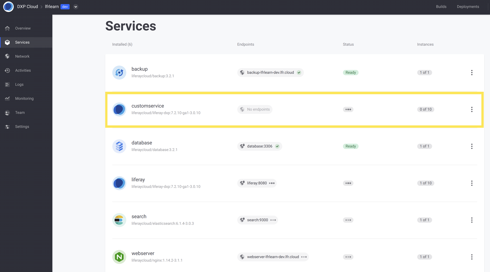

# Using a Custom Service

Liferay Cloud allows you to run more than just the standard set of services provided out-of-the-box. You can also create and deploy a custom service to run any new processes within the Liferay Cloud infrastructure. Customers who wish to enable the use custom services on their Liferay Cloud environments must first contact their sales representative in order to enable this functionality and ensure that their environments are provisioned accordingly.

```{note}
You must have sufficient hardware resources provisioned to be able to add a custom service. You can allocate additional resources for custom services during the provisioning process.
```

Liferay Cloud uses Docker images as the basis for its services. If you want to run these services locally, [install Docker](https://docs.docker.com/get-docker/) on your local system.

See the [custom services limitations](../reference/platform-limitations.md#custom-services) for more information.

## Adding a Custom Service

Use the following steps to add your own custom service to a build in Liferay Cloud:

1. Create or find your custom service as a Docker image. You can either use a Dockerfile that you add to your project's workspace directly or an image from a public repository like [Docker Hub](https://hub.docker.com/).

1. Add a new directory for your service alongside the other service directories (e.g., `liferay` and `database`), with an `LCP.json` file in it:

	```
    ├── backup
    ├── ci
    ├── database
    ├── liferay
    ├── search
    ├── webserver
    └── myCustomService
        └── LCP.json
	```

	See [Configuration via LCP.json](../reference/configuration-via-lcp-json.md) for more information on adding configurations to this file.

    ```{warning}
    If you trigger a build with a new custom service, but do not have enough resources provisioned for the new service, then it may interfere with the resources allocated to your other services.

    Directly set the memory and CPU allocation for your new service in its LCP.json file to make sure it gets the correct amount of hardware resources.
    ```

1. Specify which environments your custom service will apply to in your `LCP.json`. This may depend on how many resources you have provisioned for your new service.

    For example, to only apply the build to your `prd` environment, add the following property to your `LCP.json`:

    ```json
    {
      "environments": {
          "prd": {
            "deploy": true
          }
      }
    }
    ```

    If no such properties are specified, then by default, the service will attempt to build the custom service for all environments.

1. Apply your Docker image to the new service. The method to use to add your Docker image depends on whether you are using an image uploaded to a public repository, or a local Dockerfile.

    * **If you are using a Docker image from a public repository:** Add the name of your image to an `image` property within your `LCP.json`:

      ```
      "image": "mydockerimages/myservice:1.0.0"
      ```

    * **If you are using a local Dockerfile:** Add the Dockerfile into your custom service's directory. When your service is built, the Docker image from the Dockerfile will automatically be picked up as the image for the service.

      ```{note}
      The Dockerfile is automatically used as the image for your service. As a result, any "image" property in your LCP.json will be ignored.
      ```

1. Commit these changes to your branch in version control:

    ```bash
    git add my-custom-service/
    git commit -m "Add custom service"
    ```

1. Push your branch up and start a new build in Liferay Cloud to deploy. See the information on deployment in the [Overview of Liferay Cloud Deployment](../build-and-deploy/overview-of-the-liferay-cloud-deployment-workflow#deploy) for help with deploying your build.

Once you have triggered a new build in CI with your changes, you can navigate to the _Builds_ screen in the Liferay Cloud console to see the build. The services listed under the _Services_ column includes the new service with the others.

If you deploy this build to one of your environments (by clicking _Deploy Build to_ in the Actions menu), then you can also navigate to that environment's _Services_ page to see the custom service listed there:



## Related Topics

* [Overview of the Liferay Cloud Deployment Workflow](../build-and-deploy/overview-of-the-liferay-cloud-deployment-workflow)
