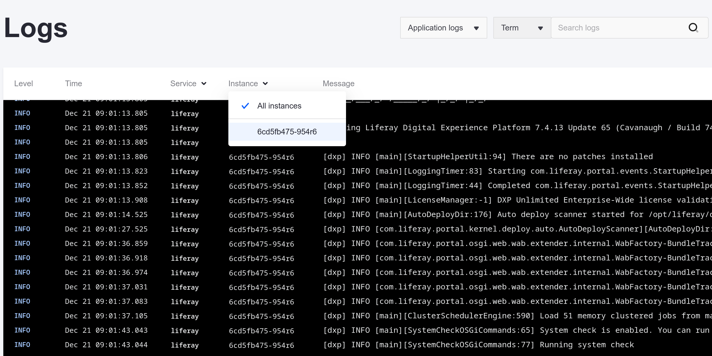
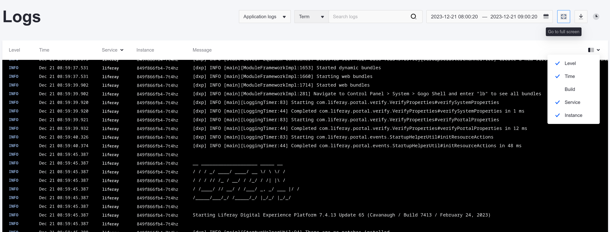
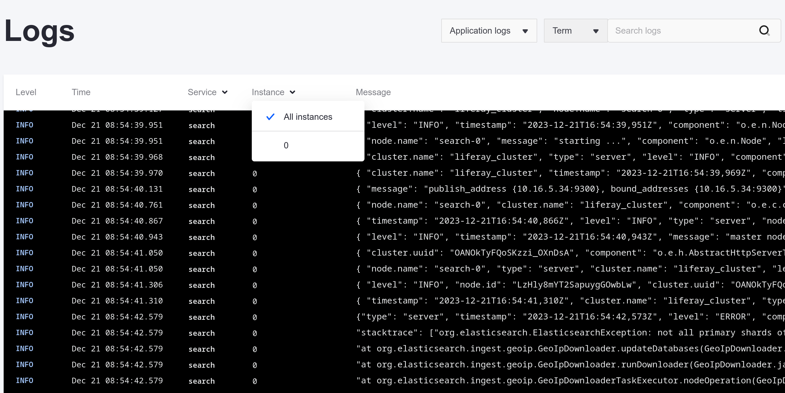

# Reading Liferay Cloud Service Logs

Environment logs are crucial for diagnosing and resolving technical issues in a project. Liferay Cloud provides a variety of environment logs that users can access and download via the Liferay Cloud console or OS terminal.

## Log Types

Liferay Cloud provides three types of logs for environment services:

* **Build Logs**: These logs list build information generated as the application boots up. Examples of build information include: when Docker images are pulled from the registry, when deploys are in progress, and when builds are successful.

* **Status Logs**: These logs list orchestration layer information from the Kubernetes cluster. Examples of status information include: when images are successfully pulled, when containers are created and started, and when readiness or liveness probes fail.

* **Application Logs**: These logs list runtime information generated after the application is running and accessed by users.

## Log Structure

Logs in Liferay Cloud conform to a specific structure that gives extra, contextual information. See this log message as an example:

```log
Jun 29 10:07:46.585 build-214 [webserver-699bf65bfb-4w8pl] [WARNING] 179/170746 (13) : api/backend2 changed its IP from 10.0.17.186 to 10.0.26.120 by DNS cache.
```

Many logs in Liferay Cloud have a label (in this example, ``[WARNING]``) that indicates that this message came from Liferay Cloud infrastructure, and not directly from the service's output. Logs can also have labels that come from Liferay Cloud infrastructure but are related to the service, such as ``[LIFERAY]``. Logs that come directly from the service's output have no label.

Additionally, these components are always present in any log message in Liferay Cloud:

* The **timestamp**: in this example, `Jun 29 10:07:46.585`.

* The **build ID**: in this example, `build-214`. This corresponds to the build that the currently deployed version of the service corresponds to. You can match this build ID to the list of builds shown in your project's *Builds* page.

* The **instance ID**: in this example, `[webserver-699bf65bfb-4w8pl]`. This is used to identify which instance of a service a message is related to.

The instance ID associated with a log message corresponds to one of the instances of your service. You can see (and filter by) all of the active instances in your service from the Logs page by clicking on the instances dropdown menu above the logs:



The format of the instance ID depends on what deployment type (deployment or stateful set) the service is configured as. See [Understanding Deployment Types](../build-and-deploy/understanding-deployment-types.md) for more information.

### Instance ID for Deployment Type Logs

Deployment type logs have an instance ID with multiple parts. See this example of a log message from a deployment type service:

```log
Jun 29 10:07:57.102 build-214 [liferay-7485669bdd-7ktfl] [LIFERAY] Executing 010_liferay_cloud_customizable_files_override.sh.
```

The instance ID for this message (in this example, `[liferay-7485669bdd-7ktfl]`) contains these components:

* The **service name**: in this example, `liferay`.

* A randomly generated **version ID**: in this example, `7485669bdd`. This corresponds to the version of your service that has been deployed with possible changes. Note that new deployments, changes to environment variables, and even manually restarting the service all generate a new version ID (because a new change may have been made in the configuration).

* A randomly generated **container ID**: in this example, `7ktfl`. Whenever a new container is created (for example, after you deploy a new build and the service restarts), a new container ID is generated because a new container is created each time the service starts up. Note that any restart generates a new container ID, even when the version ID does not change (for example, when a [liveness or readiness probe failure](../troubleshooting/self-healing.md) triggers a restart).

### Instance ID for Stateful Set Type Logs

Stateful set type logs have a smaller and more consistent instance ID. See this example of a log message from a stateful set type service:

```log
Jun 29 07:44:44.676 build-214 [search-0] #  - Creating and Starting rollup jobs will no longer be allowed.
```

These are the only components of the `instance ID` for stateful set type services:

*  The **service name**: in this example, `search`.

* An iterating (non-random) **node ID**: in this example, `0`. This ID remains the same even after deploying new versions of the service.

The entire instance ID for stateful set type services always remains the same for each node of the service. This allows you to reliably use the same instance ID to identify the node in a cluster with the same [volume](../build-and-deploy/configuring-persistent-file-storage-volumes.md), even after the service has been redeployed.

## Accessing Logs via the Liferay Cloud Console

Follow these steps to access environment service logs via the Liferay Cloud console:

1. Navigate to a project environment.

1. Click on *Logs* in the environment menu.

View application, status, and build logs across all environment services or [filter results](#searching-and-filtering-logs) using the drop-down menus.

To download logs, click the *Download Logs* button.


Individual service logs are also available under the Logs tab in each service's dedicated page.



### Searching and Filtering Logs

You can filter by [type](#log-types) or by service on the Logs page. If you filter logs by a service, another drop-down menu appears for filtering by a specific node.



To filter by a date range, use the date picker at the top-right corner. You cannot choose a date that [no longer has valid logs](../reference/platform-limitations.md#all-services).


You can search the logs for a specific term or regular expression. Select *Term* or *Regex* from the drop-down menu, and then enter your search term or regular expression. Search suggestions appear based on previous searches. Regular expressions use the [RE2 syntax](https://github.com/google/re2/wiki/Syntax).


On a service's page, you can only filter logs by type or instance.

## Accessing Logs via the Terminal

Administrators and developers can also view logs via an OS terminal.

Run the following command to list logs for all services:

```shell
lcp log
```

To access service logs from a specific environment, either enter the environment's ID after running the `lcp log` command, or run the `lcp log` command with the environment ID:

```shell
lcp log -p <environment-id>
```

Users can also specify a service as part of the `lcp log` command:

```shell
lcp log -p <environment-id> -s <service-id>
```

## Additional Information

* [Shell Access](./shell-access.md)
* [Disaster Recovery Overview](./disaster-recovery-overview.md)
* [Configuring Cross-Region Disaster Recovery](./configuring-cross-region-disaster-recovery.md)
