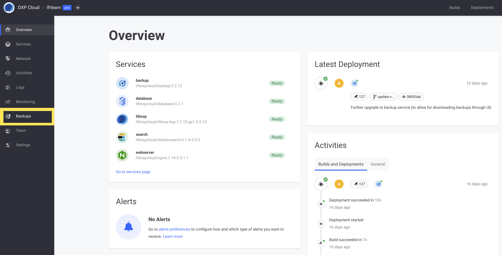
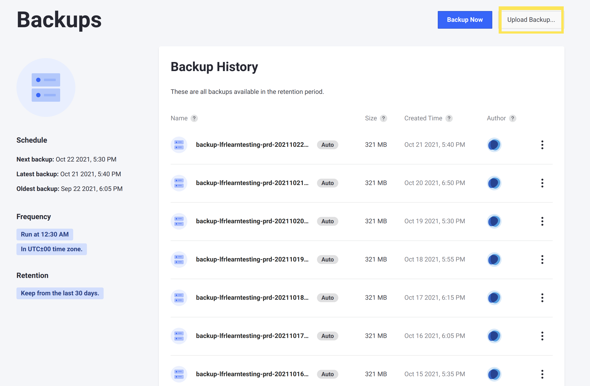
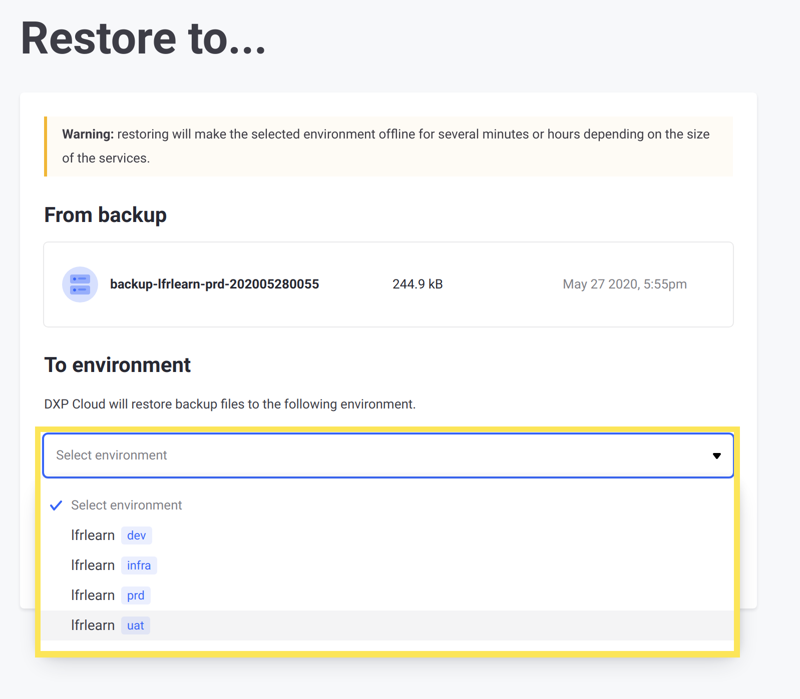

# Upgrading Your Liferay DXP Instance

Liferay periodically releases new minor and major versions of Liferay DXP that include security and bug fixes, as well as enhancements. To upgrade to a new major Liferay DXP version increment, you must upgrade the DXP database.

```{note}
For large data sets in production, there are several additional considerations to perform a smooth upgrade. For example, custom code or Marketplace apps may require additional updates to continue working properly. See [the guide to upgrading Liferay DXP](https://learn.liferay.com/dxp/latest/en/installation-and-upgrades/upgrading-liferay/upgrade-basics.html) for a comprehensive overview of the core upgrade.
```

```{note}
To update to new minor versions or service packs, instead see [Updating to a New Version of Liferay DXP](./updating-your-dxp-instance-to-a-new-minor-version.md).
```

```{important}
Upgrading an environment in Liferay Cloud requires restoring an upgraded database, and therefore involves downtime for the Liferay service to restart. Plan ahead for this downtime for production environments.
```

Review the following steps to perform a database upgrade:

1. [Install prerequisites](#install-prerequisites)
1. [Download a backup](#download-a-backup)
1. [Extract and import the data](#extract-and-import-the-data)
1. [Perform the data upgrade](#perform-the-data-upgrade)
1. [Compress the document library and database](#compress-the-document-library-and-database)
1. [Upload the document library and database](#upload-the-document-library-and-database)
1. [Restore the backup](#restore-the-backup)

## Install Prerequisites

Before beginning the upgrade procedure, satisfy the following prerequisites:

* [A locally available MySQL installation](https://dev.mysql.com/doc/mysql-installation-excerpt/5.7/en/).
* [Downloaded bundle of Liferay DXP](https://customer.liferay.com/en_US/downloads) for the version of DXP you are upgrading to. Extract this bundle to a location of your choosing.

```{important}
Download a fresh bundle for the upgrade instead of reusing an old one. Data from previous usage may interfere with the data upgrade.
```

## Download a Backup

Perform the following steps to download a backup (consisting of both the database and data volume) of the DXP instance currently running in your `prd` environment:

1. Log in to the [Liferay Cloud console](https://console.liferay.cloud/login).

1. Navigate to your production environment, then select _Backups_ from the menu.

    

1. Choose one of the backups listed and select _Download_ from the Actions menu. Download the data volume and database zip files.

    

## Extract and Import the Data

The next step is to extract the data from the downloaded archives and move the data to where it is needed for the upgrade.

### Extract the Data Volume

Perform the following steps to extract the data volume from the backup:

1. Move the downloaded `.tgz` archive of the data volume (named `backup-lfr-<PROJECT_NAME>-prd-<BACKUP_ID>.tgz`) into the `LIFERAY_HOME/data` folder of the Liferay bundle you extracted earlier.

1. Extract the archive by running this command:

    ```bash
    tar -xvzf ARCHIVE_NAME.tgz
    ```

### Extract and Import the Database

Open a command prompt at the location of the downloaded database archive (named `backup-db-<PROJECT_NAME>-prd-<BACKUP_ID>.tgz`) and perform the following steps to import it to MySQL:

1. Extract the database archive:

    ```bash
    tar -xvzf ARCHIVE_NAME.tgz
    ```

1. Log into the MySQL client on your local system:

    ```bash
    mysql -u root -ppassword
    ```

1. Create a database to import the data into, using the name of the file (minus the extension) as the database name:

    ```
    create database DATABASE_NAME;
    ```

1. Import the database from the extracted `.sql` dump:

    ```
    use DATABASE_NAME;
    ```

    ```
    source DATABASE_NAME.sql;
    ```

1. Finally, disconnect from the MySQL client:

    ```
    exit
    ```

The database and document library are now in place and ready for you to perform the data upgrade.

## Perform the Data Upgrade

DXP bundles provide an upgrade tool that is used for data upgrades. This tool is invoked through a script included in the bundle, `db_upgrade.sh`.

```{note}
The database upgrade tool can be pre-configured for more flexibility when running it. See [Using the Database Upgrade Tool](https://learn.liferay.com/dxp/latest/en/installation-and-upgrades/upgrading-liferay/upgrade-basics/using-the-database-upgrade-tool.html) for more information on advanced usage.
```

Open a command prompt within your `LIFERAY_HOME/tools/portal-tools-db-upgrade-client` folder. Then, run the following command:

```bash
db_upgrade.sh -j "-Dfile.encoding=UTF-8 -Duser.timezone=GMT -Xmx2048m" -l "output.log"
```

The upgrade tool prompts you for information about your installation before beginning the data upgrade. If you have downloaded a Liferay bundle with Tomcat, then it automatically detects some of the directories as default values.

Here is an example interaction with the upgrade tool entering this information:

```
Please enter your application server (tomcat):
tomcat

Please enter your application server directory (../../tomcat-9.0.17):

Please enter your extra library directories (../../tomcat-9.0.17/bin):

Please enter your global library directory (../../tomcat-9.0.17/lib):

Please enter your portal directory (../../tomcat-9.0.17/webapps/ROOT):

[ db2 mariadb mysql oracle postgresql sqlserver sybase ]
Please enter your database (mysql):
mysql

Please enter your database host (localhost):

(etc.)
```

Once you enter the required information, the upgrade tool performs the data upgrade. When the following messages appear in the console, the upgrade is complete:

```
Completed Liferay core upgrade and verify processes in 64 seconds
Checking to see if all upgrades have completed... done.
```

Test the bundle locally to ensure the upgrade completed smoothly. You can test the instance locally by running the following command from `LIFERAY_HOME/tomcat-9.x.x/bin/`:

```bash
./catalina.sh run
```

Once the upgrade is complete and verified, your database and data volume are ready to be uploaded to Liferay Cloud.

## Compress the Document Library and Database

Now that your Liferay installation has been upgraded, use the following steps to prepare to upload them to your `backup` service

### Compress the Document Library

1. Open a command prompt within your `LIFERAY_HOME/data` folder.

1. Run the following command to compress your document library into a `.tgz` archive:

    ```bash
    tar -czvf volume.tgz document_library
    ```

    ```{important}
    If the data volume you downloaded contained more folders (such as a `license/` folder), then add these as additional arguments after `document_library`.
    ```

### Export and Compress the Upgraded Database

1. Run the following command to perform a database dump:

    ```
    mysqldump -uroot -ppassword --databases --add-drop-database lportal | gzip -c | cat > database.gz
    ```

1. Compress this file into a `.tgz` archive with the following command:

    ```bash
    tar zcvf database.tgz database.gz
    ```

The database and Liferay data volume are now ready for upload to the `backup` service.

## Upload the Document Library and Database

Upload the document library and database archives to the `backup` service via the console:

1. If you are not already logged in, log into the [Liferay Cloud console](https://console.liferay.cloud/login).

1. Navigate to the *Backups* page for the appropriate environment.

1. Click *Upload Backup...* near the top of the screen.

    

1. On the Upload Backup page, expand the appropriate environment, and click the `+` icons for both the database and document library to upload them.

    

1. When both the database dump and document library are uploaded, click *Initiate Upload*.

```{note}
You can also upload the database dump and document library via the upload APIs. See the [Backup Service APIs](../platform-services/backup-service/downloading-and-uploading-backups.md#backup-service-apis) for more information.
```

When the upload is complete, a new backup appears at the top of the list on the Backups page.

## Update Your Project's Liferay Image Version

You must update the version of the Liferay image your environment uses so that the upgraded database works correctly.

Update these locations as needed to reflect the new version of Liferay DXP:

* The `image` property in `liferay/LCP.json`. Check the [Services Changelogs](https://help.liferay.com/hc/en-us/sections/360006251311-Services-Changelog) for an updated image, and make sure the upgraded DXP version matches the version in the image (for example, `7.2` in `liferaycloud/liferay-dxp:7.2-4.0.7`).

* The `liferay.workspace.docker.image.liferay` property in `liferay/gradle.properties`. Check the [Liferay DXP Docker Hub page](https://hub.docker.com/r/liferay/dxp/tags) for an image that matches your upgraded DXP version.

When both of these image versions are updated, [deploy the changes](./deploying-to-the-liferay-service.md) to your chosen environment. This prepares the Liferay service for you to restore your uploaded backup.

## Restore the Backup

Follow these steps to restore a backup to your chosen environment:

1. Log into the Liferay Cloud console, if you are not already logged in.

1. Navigate to the environment [you uploaded your backup to](#upload-the-document-library-and-database), then click _Backups_ from the side menu.

1. Choose a backup from the list, and then click _Restore to_ from the Actions menu for that backup.

    

1. Select one of your environments to restore to from the drop-down list (e.g., your `dev` environment).

    

1. Click _Restore to environment_.

    ```{note}
    The chosen environment will be unavailable while the the backup is being deployed.
    ```

<!-- I'd also want to know if there is a zero downtime way to do an upgrade - because that's one of the next questions I would ask if I put myself in the shoes of someone trying to run a prod and business critical env. We may not be ready to say anything about that - but just a thought to put in your mind as potentially a future iteration of this - or let's say if we find out that you CAN do a zero downtime upgrade using a DR environment, then we should update this article to say so. An example:

Upgrading the liferay service requires a database upgrade and restoring the liferay service using the upgraded database. The process of restoring the upgraded database from backup requires some downtime and we recommend testing your upgrade on the DEV or UAT environments first. Zero downtime upgrades are possible using a DR environment. 

-->

Congratulations! You have upgraded your DXP database to the new version and deployed it to your chosen environment. You can also [restore the same backup](#restore-the-backup) again to other environments as needed.

## Additional Information

Learn more about DXP upgrades:

* [Liferay DXP Upgrade Basics](https://learn.liferay.com/dxp/latest/en/installation-and-upgrades/upgrading-liferay/upgrade-basics.html)
* [Updating Your DXP Instance to a New Minor Version](./updating-your-dxp-instance-to-a-new-minor-version.md)
* [Using the Database Upgrade Tool](https://learn.liferay.com/dxp/latest/en/installation-and-upgrades/upgrading-liferay/upgrade-basics/using-the-database-upgrade-tool.html)
